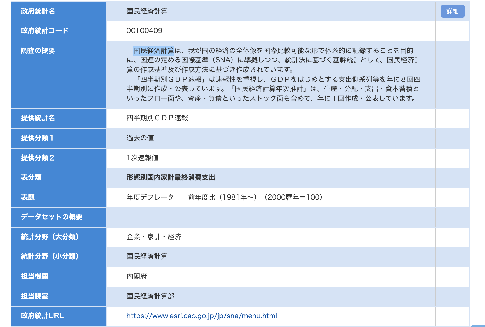
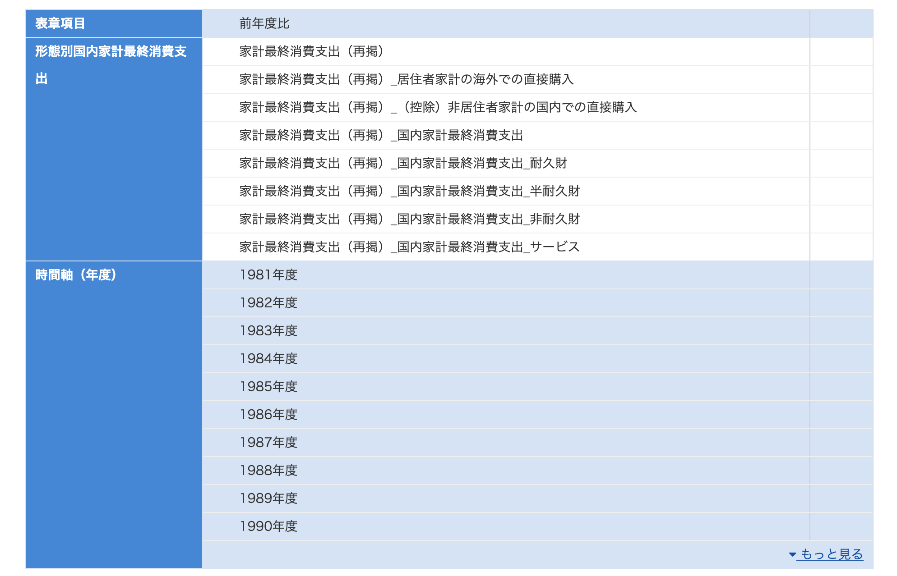

 今回は前回登場したデータの内容を調べてみましょう。  
 「統計表情報取得」（リスト取得）APIで取得したデータをもとにe-Statのサイト（https://www.e-stat.go.jp/）からデータを見つけてみましょう。  
 
 ```
 <LIST_INF id="0003384123">
            <STAT_NAME code="00100409">国民経済計算</STAT_NAME>
            <GOV_ORG code="00100">内閣府</GOV_ORG>
            <STATISTICS_NAME>四半期別ＧＤＰ速報 過去の値 1次速報値</STATISTICS_NAME>
            <TITLE>形態別国内家計最終消費支出 年度デフレータ—　前年度比（1981年～）（2000暦年＝100）</TITLE>
            <CYCLE>四半期</CYCLE>
            <SURVEY_DATE>201007-201009</SURVEY_DATE>
            <OPEN_DATE>2020-04-01</OPEN_DATE>
            <SMALL_AREA>0</SMALL_AREA>
        </LIST_INF>
```
## データを検索してみよう
 IDで検索できるのが一番良いのですが、キーワード検索のテキストフィールドに入力して検索してもダメでした。  
 
 しょうが無いので、TITLE全文「形態別国内家計最終消費支出 年度デフレータ—　前年度比（1981年～）（2000暦年＝100）」で検索しましたがでダメでした。  

 少し削って、「形態別国内家計最終消費支出 年度デフレータ—　前年度比」  だと４０５件。  
 多すぎるので、SURVEY_DATE、OPEN_DATEを使って調査年、調査月、公開年月で絞り込むと２件に絞り込めました。  
 あとはSTATISTICS_NAMEで特定できました。  
 
 
 ## 詳細ページに行ってみましょう
 
 https://www.e-stat.go.jp/stat-search/database?page=1&query=%E5%BD%A2%E6%85%8B%E5%88%A5%E5%9B%BD%E5%86%85%E5%AE%B6%E8%A8%88%E6%9C%80%E7%B5%82%E6%B6%88%E8%B2%BB%E6%94%AF%E5%87%BA%20%E5%B9%B4%E5%BA%A6%E3%83%87%E3%83%95%E3%83%AC%E3%83%BC%E3%82%BF%E2%80%94%E3%80%80%E5%89%8D%E5%B9%B4%E5%BA%A6%20%20%20%20%20%20%20&layout=dataset&year=20100&month=23070900&open_date=202004&statdisp_id=0003384123&metadata=1&data=1
 
 上段が「統計表情報取得」の内容  
 
 下段が「メタ情報取得」の内容見たいです。  
 
 
 DBをクリックするとグラフが表示されました。  
 
 
 
 行情報が「1981年度、1982年度、1983年度。。。」  
 列情報が「家計最終消費支出（再掲）、家計最終消費支出（再掲）_居住者家計の海外での直接購入、。。。」  
 
 
 なんと、APIクリックすると丁寧にクエリを表示してくれました(API仕様書とか見る必要ないですね)。  
 
 
 フォーマットもXML,JSON,CSVが選べますね。  
 私はCSVの方が扱いやすいのでこれからはCSVでダウンロードすることにします。  
 
 
 appIdがカラに空になっているので追加してcurlで叩くだけでいいですね。至れり尽くりです。  
 
```          
curl "http://api.e-stat.go.jp/rest/3.0/app/getSimpleStatsData?appId=xxxxxxx&lang=J&statsDataId=0003384123&metaGetFlg=Y&cntGetFlg=N&explanationGetFlg=Y&annotationGetFlg=Y&sectionHeaderFlg=1&replaceSpChars=0"
    
"tab_code","表章項目","cat01_code","形態別国内家計最終消費支出","time_code","時間軸（年度）","unit","value","annotation"
"17","前年度比","11","家計最終消費支出（再掲）","1981100000","1981年度","％","3.8",""
"17","前年度比","11","家計最終消費支出（再掲）","1982100000","1982年度","％","2.3",""
"17","前年度比","11","家計最終消費支出（再掲）","1983100000","1983年度","％","2",""
.
.
.
"17","前年度比","12","家計最終消費支出（再掲）_居住者家計の海外での直接購入","1981100000","1981年度","％","17.6",""
"17","前年度比","12","家計最終消費支出（再掲）_居住者家計の海外での直接購入","1982100000","1982年度","％","15.6",""
"17","前年度比","12","家計最終消費支出（再掲）_居住者家計の海外での直接購入","1983100000","1983年度","％","-1.8",""
```

## データの見方は？

DBで表示させた「統計表表示」と見比べてみると  


```       
"17","前年度比","11","家計最終消費支出（再掲）","1981100000","1981年度","％","3.8","" 
```

が１行目「1981年度」の１列目「家計最終消費支出（再掲）」に該当するみたいですね。  
１セル、１行のデータ構造みたいですね。  
１列目の情報がしばらく続いて、全行終わると次は２列目の情報みたいな構成だということがわかりました。  
          
          
          
## 国民経済計算って何
このデータは国民経済計算を算出したものということですが、国民経済計算ってなんでしょう？  

内閣府のサイトによると  
国民経済計算は「四半期別ＧＤＰ速報」と「国民経済計算年次推計」の２つからなっている。「四半期別ＧＤＰ速報」は速報性を重視し、ＧＤＰをはじめとする支出側系列等を、年に８回四半期別に作成・公表している。「国民経済計算年次推計」は、生産・分配・支出・資本蓄積といったフロー面や、資産・負債といったストック面も含めて、年に１回作成・公表している。  

GDPを算出するための何かみたいですね。  


googleの検索結果を見てみると、国や地方自治体のサイトや経済学の解説サイトがメインで、たまに今年のGDPはどうだったという記事でちょっと書かれてたりしました。  

記事の中でちょっと気になったのは、  
日本では新型コロナウイルスの影響で個人消費が落ち込んでおり、貯蓄が増加傾向にあります。内閣府の国民経済計算によると、2020年に消費されずに貯蓄に回ったお金は、一律10万円の特別定額給付金の影響もあり、35.8兆円に達しました。この額は前年の5倍の水準です。   
所得に対する貯蓄の割合を示す家計貯蓄率は13.1%と19年度（3.7%）から大きく上昇した。  

前年度から比較して急激に大きくなったという部分(5倍も！)。こういうのは是非ピックアップしたいと思いました。  

## e-Statでのマイニングの目的は

とわ言え「国民経済計算」全般的に堅い感じですね。。。。  

私のe-Statマイニングの目的は大量の政府公開データに埋もれている中から人の興味を引きそうな面白そうなコンテンツをピックアップしてわかりやすくサマリーを表示することなのです。  

キーワードランキングを見てみると「アイスクリーム」「身長・体重の平均値」みたいな面白そうな柔らかめのコンテンツもあるんです。  


次回から、  
・e-Statの森の中から面白いコンテンツを見つけよう  
・うまくサマライズして表示しよう  
　　興味深い列情報に絞りたい  
　　前年度から５倍とか急激に変化した部分をピックアップして伝えたい  
という視点からe-Statを調査していきたいと思います。  


## 書籍の紹介
{{% amazon

title="UNIXという考え方―その設計思想と哲学 単行本 – 2001/2/23"
url="https://www.amazon.co.jp/UNIX%25E3%2581%25A8%25E3%2581%2584%25E3%2581%2586%25E8%2580%2583%25E3%2581%2588%25E6%2596%25B9%25E2%2580%2595%25E3%2581%259D%25E3%2581%25AE%25E8%25A8%25AD%25E8%25A8%2588%25E6%2580%259D%25E6%2583%25B3%25E3%2581%25A8%25E5%2593%25B2%25E5%25AD%25A6-Mike-Gancarz/dp/4274064069/ref=sr_1_1?keywords=unix%25E3%2581%25A8%25E3%2581%2584%25E3%2581%2586%25E8%2580%2583%25E3%2581%2588%25E6%2596%25B9&amp;qid=1667786898&amp;qu=eyJxc2MiOiIxLjEwIiwicXNhIjoiMC4zOSIsInFzcCI6IjAuMzEifQ%253D%253D&amp;sprefix=unix%25E3%2581%25A8%25E3%2581%2584%25E3%2581%2586%252Caps%252C257&amp;sr=8-1&_encoding=UTF8&tag=nlpqueens09-22&linkCode=ur2&linkId=0249eb4cab50d700fb6949eb9aeafef1&camp=247&creative=1211"
imageUrl="https://m.media-amazon.com/images/I/518ME653H3L._SX330_BO1,204,203,200_.jpg"
summary=`   UNIX系のOSは世界で広く使われている。UNIX、Linux、FreeBSD、Solarisなど、商用、非商用を問わず最も普及したOSのひとつであろう。そしてこのOSは30年にわたって使用され続けているものでもある。なぜこれほど長い間使われてきたのか？ その秘密はUNIXに込められた数々の哲学や思想が握っている。
   そもそもUNIXはMulticsという巨大なOSの開発から生まれたものだ。あまりに巨大なMulticsはその複雑さゆえに開発は遅々として進まず、その反省からケン・トンプソンが作ったのがUNIXの初めとされる。その後デニス・リッチーら多数の開発者が携わり、UNIXは発展した。本書はこのUNIXに込められた「思想と哲学」を抽出し、数々のエピソードとともにUNIXの特徴を浮き彫りにしていく。

   たとえば本書で述べられているUNIXの発想のひとつとして「過度の対話式インタフェースを避ける」というものがある。UNIXのシステムは初心者には「不親切」なつくり、つまり親切な対話式のインタフェースはほとんどなく、ユーザーがコマンドを実行しようとするときはオプションをつける形をとっている。この形式はオプションをいちいち覚えねばならず、初心者に決してやさしくない。しかしこれはプログラムを小さく単純なものにし、他のプログラムとの結合性を高くする。そして結果としてUNIXのスケーラビリティと移植性の高さを支えることになっているのだ。このような形式で本書では9つの定理と10の小定理を掲げ、UNIXが何を重視し、何を犠牲にしてきたのかを明快に解説している。

   最終章にはMS-DOSなどほかのOSの思想も紹介されている。UNIXの思想が他のOSとどう違うかをはっきり知ることになるだろう。UNIXの本質を理解するうえで、UNIX信者もUNIX初心者にとっても有用な1冊だ。（斎藤牧人）`
%}}

{{% amazon

title="詳解 シェルスクリプト 大型本  2006/1/16"

url="https://www.amazon.co.jp/gp/proteect/4873112672/ref=as_li_tl?ie=UTF8&camp=247&creative=1211&creativeASIN=4873112672&linkCode=as2&tag=nlpqueens09-22&linkId=ef087fd92d3628bb94e1eb10cb202d43"

summary=`Unixのプログラムは「ツール」と呼ばれます。
Unixは、処理を実現するために複数の道具(ツール)を組み合わせる「ソフトウェアツール」という思想の下に設計されているためです。
そしてこれらツールを「組み合わせる」ということこそがUnixの真髄です。
また、シェルスクリプトの作成には言語自体だけでなくそれぞれのツールに対する理解も求められます。
つまり、あるツールが何のためのものであり、それを単体あるいは他のプログラムと組み合わせて利用するにはどのようにすればよいかということを理解しなければなりません。
本書は、Unixシステムへの理解を深めながら、シェルスクリプトの基礎から応用までを幅広く解説します。
標準化されたシェルを通じてUnix(LinuxやFreeBSD、Mac OS XなどあらゆるUnix互換OSを含む)の各種ツールを組み合わせ、
目的の処理を実現するための方法を詳しく学ぶことができます。
`
imageUrl="https://m.media-amazon.com/images/I/51EAPCH56ML._SL250_.jpg"
%}}

{}


{{% amazon

title="[改訂第3版]シェルスクリプト基本リファレンス ──#!/bin/shで、ここまでできる (WEB+DB PRESS plus) 単行本（ソフトカバー）  2017/1/20"

url="https://www.amazon.co.jp/gp/proteect/4774186945/ref=as_li_tl?ie=UTF8&camp=247&creative=1211&creativeASIN=4774186945&linkCode=as2&tag=nlpqueens09-22&linkId=8ef3ff961c569212e910cf3d6e37dcb6"

summary=`定番の1冊『シェルスクリプト基本リファレンス』の改訂第3版。
シェルスクリプトの知識は、プログラマにとって長く役立つ知識です。
本書では、複数のプラットフォームに対応できる移植性の高いシェルスクリプト作成に主眼を置き、
基本から丁寧に解説。
第3版では最新のLinux/FreeBSD/Solarisに加え、組み込み分野等で注目度の高いBusyBoxもサポート。
合わせて、全収録スクリプトに関してWindowsおよびmacOS環境でのbashの動作確認も行い、さらなる移植性の高さを追求。
ますますパワーアップした改訂版をお届けします。`
imageUrl="https://m.media-amazon.com/images/I/41i956UyusL._SL250_.jpg"
%}}

{{% amazon

title="新しいシェルプログラミングの教科書 単行本"

url="https://www.amazon.co.jp/gp/proteect/4797393106/ref=as_li_tl?ie=UTF8&camp=247&creative=1211&creativeASIN=4797393106&linkCode=as2&tag=nlpqueens09-22&linkId=f514a6378c1c10e59ab16275745c2439"

summary=`エキスパートを目指せ!!

システム管理やソフトウェア開発など、
実際の業務では欠かせないシェルスクリプトの知識を徹底解説

ほとんどのディストリビューションでデフォルトとなっているbashに特化することで、
類書と差別化を図るとともに、より実践的なプログラミングを紹介します。
またプログラミング手法の理解に欠かせないLinuxの仕組みについてもできるかぎり解説しました。
イマドキのエンジニア必携の一冊。

▼目次
CHAPTER01 シェルってなんだろう
CHAPTER02 シェルスクリプトとは何か
CHAPTER03 シェルスクリプトの基本
CHAPTER04 変数
CHAPTER05 クォーティング
CHAPTER06 制御構造
CHAPTER07 リダイレクトとパイプ
CHAPTER08 関数
CHAPTER09 組み込みコマンド
CHAPTER10 正規表現と文字列
CHAPTER11 シェルスクリプトの実行方法
CHAPTER12 シェルスクリプトのサンプルで学ぼう
CHAPTER13 シェルスクリプトの実用例
CHAPTER14 テストとデバッグ
CHAPTER15 読みやすいシェルスクリプト
`
imageUrl="https://m.media-amazon.com/images/I/41d1D6rgDiL._SL250_.jpg"
%}}


