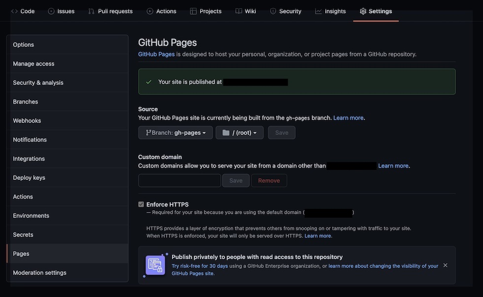

デザイナーでもできる初めてのHugoの2回目になります。
[前回（デザイナーでもできる初めてのHugo #01）](/posts/2021-12-21/)はHugoのインストールから公開の方法までを説明しました。
今回は前回作成したページをGitHub Pagesを使って公開してみたいと思います。

## GitHub Pages用の設定ファイルを作成
GitHub PagesはGitHubにあるコンテンツを静的ページを公開する機能です。
SSLまでついているので、非常に便利です。

公開用のファイルは`.github/workflows/gh-pages.yml`というYAML形式のファイルになります。

```yaml:.github/workflows/gh-pages.yml
name: Hugo

on:
  push:
  # schedule:
    # - cron: '*/10 * * * *'

jobs:
  gh-pages:
    runs-on: ubuntu-latest
    steps:
      - name: Checkout
        uses: actions/checkout@v2
        with:
          persist-credentials: false
          submodules: true  # Fetch Hugo themes (true OR recursive)
          fetch-depth: 0    # Fetch all history for .GitInfo and .Lastmod

      # https://github.com/marketplace/actions/github-pages-action
      - name: Setup
        uses: peaceiris/actions-hugo@v2
        with:
          hugo-version: 'latest'
          extended: true

      - name: Build
        run: hugo --minify

      - name: Deploy
        uses: peaceiris/actions-gh-pages@v3
        with:
          github_token: ${{ secrets.GITHUB_TOKEN }}
          publish_branch: gh-pages
```

**name**はGitHubでのActionsに表示される名前になります。
今回は公開用として**gh-pages**というブランチにわけています。ここおらへんはお好みで設定して下さい。
hugoでテーマを使っている場合は**submodules: true**とする必要があります。
また、Hugoで更新日をGitの日付と合わせたい場合は**fetch-depth: 0**として、Gitの履歴を取得するようにしましょう。

## GitHub Pagesの設定
GitHub PagesのURLは`https://ユーザまたは組織名.github.io/リポジトリ名`となります。
GitHubでリポジトリを作成する際に「ユーザまたは組織名.github.io」とすると「https://ユーザまたは組織名.github.io」とすることができます。

まずは先程のファイルを含めてサイト全体をGitにアップして、gh-pagesというブランチが作られるのを待ちましょう。
その後に、setings > Pages にでGitHub Pagesの設定を行います。



Your GitHub Pages site is currently being built from the gh-pages branch
にあるBranchをgh-pagesに変更します。
設定は以上です。

Hugoの初期設定であれば`publishDir: public`となっているので、GitHub Pagesではpublicがルートディレクトリとして公開されます。
.gitignoreに「public」を除外するようにしておきましょう。

```:.gitignore
/public
/resources
```

最後に設定したURLにアクセスするとサイトが確認できるはずです。

## まとめ
GitHub Pagesを使えば、難しいサーバの設定などをすることなく、無料でSSL付きのサイトを公開することが可能です。
いくつかの制限はありますが、すごく便利な機能なのでみなさんもぜひ使ってみてはいかがでしょうか。

公開する際はパスワードなどの情報も一緒にアップしないようにしてください。

## 書籍の紹介
{{% amazon

title="いちばんやさしいGit&GitHubの教本 人気講師が教えるバージョン管理＆共有入門 「いちばんやさしい教本」シリーズ"

url="https://www.amazon.co.jp/gp/product/B07LBSWJNP/ref=as_li_tl?ie=UTF8&camp=247&creative=1211&creativeASIN=B07LBSWJNP&linkCode=as2&tag=nlpqueens-22&linkId=fd3f2918d16f32f53feccf492263133a"

summary=`実際のワークフローをイメージしながら
実践的なGit/GitHubの使い方が身につく「いちばんやさしい」入門書です。
前半は、手元のパソコンでファイルを実際にバージョン管理しながら、
Gitの基本的な使い方を解説。`

imageUrl="//ws-fe.amazon-adsystem.com/widgets/q?_encoding=UTF8&MarketPlace=JP&ASIN=B07LBSWJNP&ServiceVersion=20070822&ID=AsinImage&WS=1&Format=_SL250_&tag=nlpqueens-22"
%}}

{{% amazon

title="Web制作者のためのGitHubの教科書 チームの効率を最大化する共同開発ツール"

url="https://www.amazon.co.jp/Web%E5%88%B6%E4%BD%9C%E8%80%85%E3%81%AE%E3%81%9F%E3%82%81%E3%81%AEGitHub%E3%81%AE%E6%95%99%E7%A7%91%E6%9B%B8-%E3%83%81%E3%83%BC%E3%83%A0%E3%81%AE%E5%8A%B9%E7%8E%87%E3%82%92%E6%9C%80%E5%A4%A7%E5%8C%96%E3%81%99%E3%82%8B%E5%85%B1%E5%90%8C%E9%96%8B%E7%99%BA%E3%83%84%E3%83%BC%E3%83%AB-%E5%A1%A9%E8%B0%B7-%E5%95%93/dp/4844337009?__mk_ja_JP=%E3%82%AB%E3%82%BF%E3%82%AB%E3%83%8A&crid=3C1ZNYZB4N0C3&keywords=github&qid=1640665205&sprefix=github%2Caps%2C284&sr=8-8&linkCode=ll1&tag=nlpqueens-22&linkId=65876fc9d77e695d11f02ec867bc8c4a&language=ja_JP&ref_=as_li_ss_tl"
summary=`そろそろ「プルリ」しませんか?しくみを理解して使えば怖くない。リポジトリの作成から複数デザインの提示、「Pull Request」を使った分担作業まで、Webサイト制作を例に実践的なワークフローを身に付ける。`
imageUrl="//ws-fe.amazon-adsystem.com/widgets/q?_encoding=UTF8&ASIN=4844337009&Format=_SL250_&ID=AsinImage&MarketPlace=JP&ServiceVersion=20070822&WS=1&tag=nlpqueens-22&language=ja_JP"
%}}
