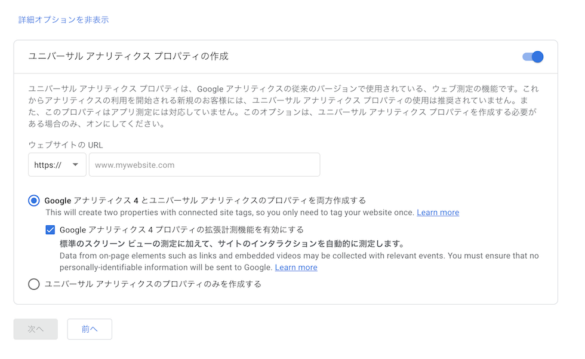
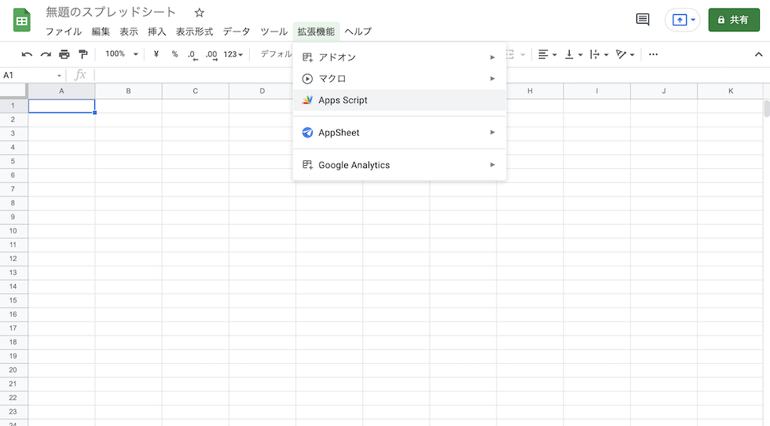
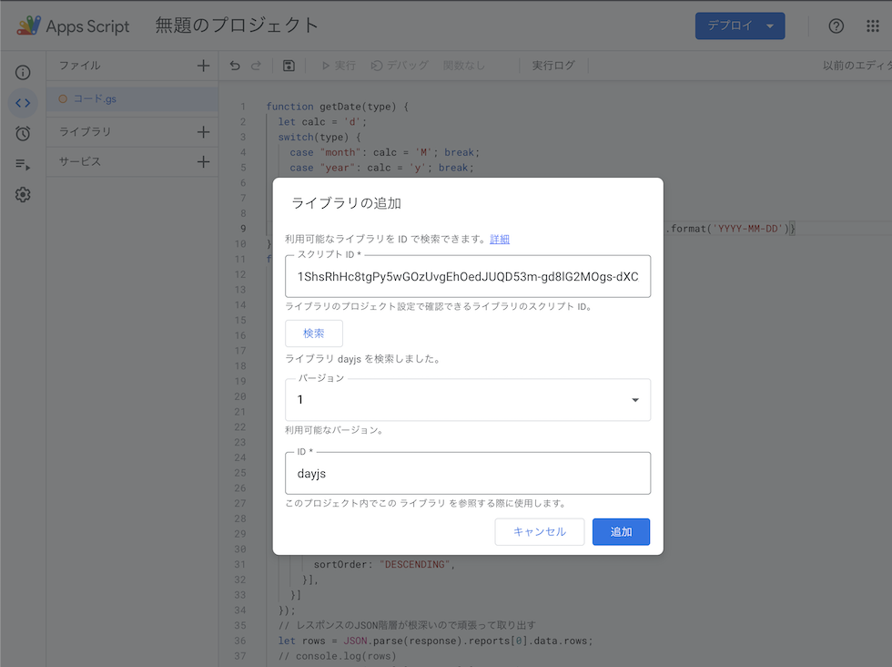
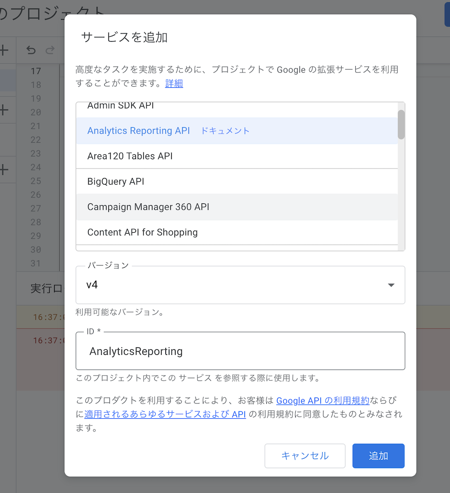
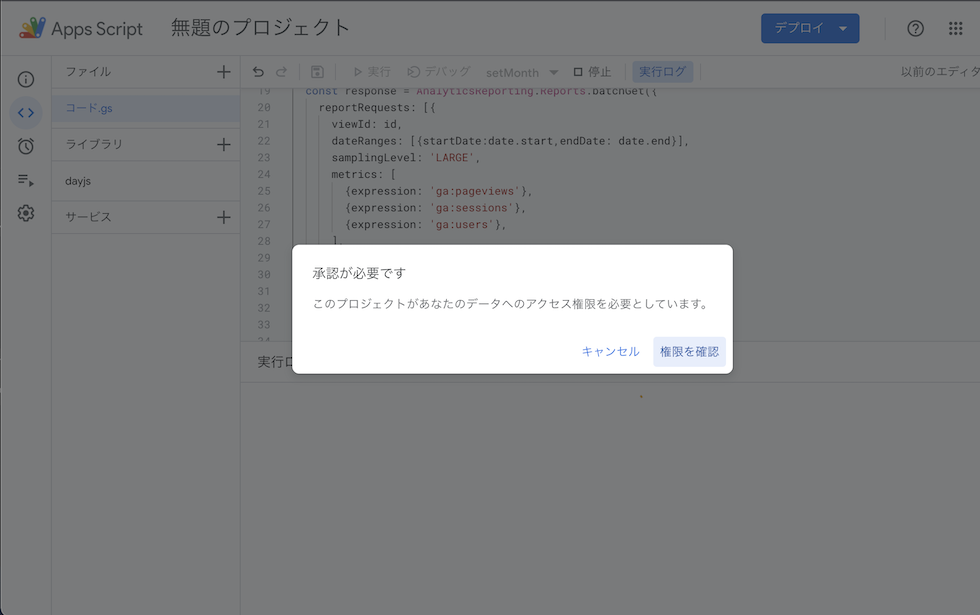
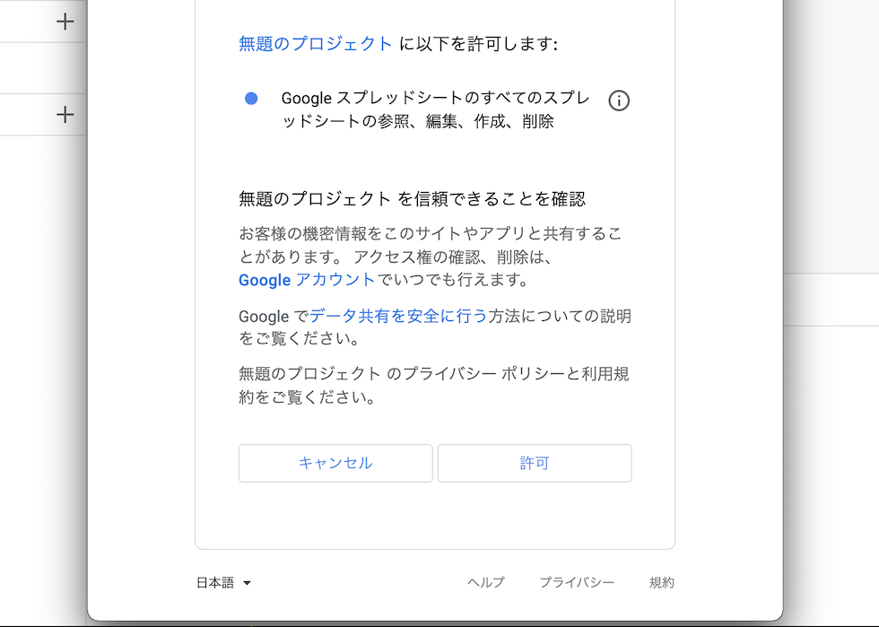
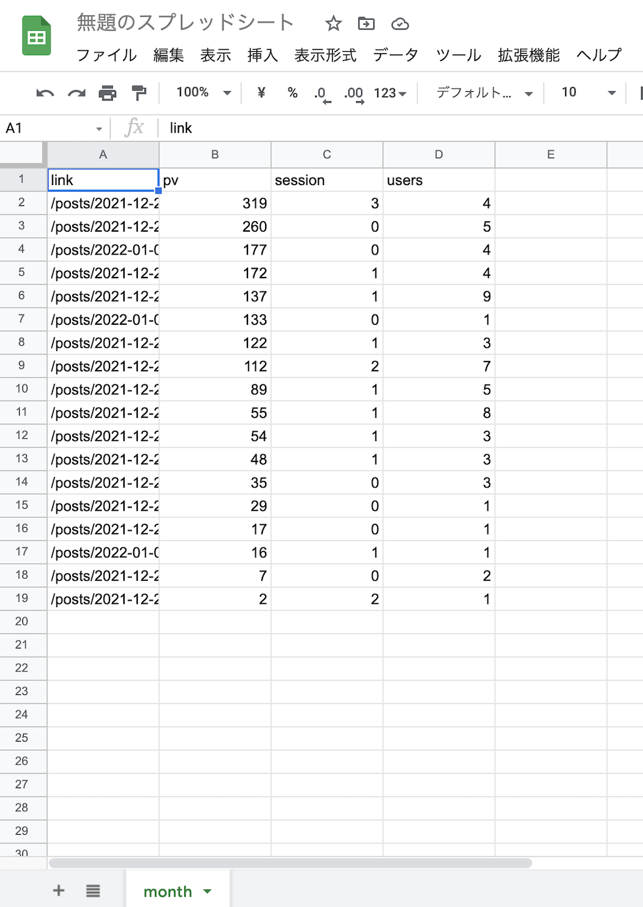

Hugoには様々な機能があり、ブログを作るにはもってこいの静的サイトジェネレータです。
関連記事も取得できて、検索機能もある「至れり尽くせり」なジェネレータだと思います。

しかし、1点だけどうしても重要な機能がありません。
それは人気記事の表示です。
人気記事を表示させるとなると、データベースを用意したりサーバのアクセスカウントを行う必要があります。
そんな面倒なことはしたくありませんよね？

今回はHugoでも簡単に人気の記事を表示する方法を紹介いたします。

## 必要なもの
Hugoで人気記事を出すために必要なものは、
- Googleスプレッドシート
- Googleアナリティクス

以上です。
それでは実際の設定やプログラムを行っていきましょう。

## Googleアナリティクスの設定
Googleアナリティクスをサイトに設定します。
設定の際にはv4ではなく、v2が必要です。(2022年1月6日現在)
v4を設定している場合は、同時にv2も設定する必要があります。

「アカウントを作成」「アカウントの設定」をした後に、「 **プロパティの設定** 」で「ユニバーサル アナリティクス プロパティの作成」をONにするとv4とv2の両方でアナリティクスを設定することができます。


あとはv4とv2のコードをサイトに貼り付けるだけです。
貼り付け方法はGoogleに書いてある通りです。

## スプレッドシートの設定
次にスプレッドシートを設定します。
Googleドライブで「新規」「Googleスプレッドシート」でシートを作成します。
作成したシートに適当な名前をつけます。

その後に、「拡張機能」の「App Script」を押して、GoogleAppScript（GAS）に移動します。


## GASのプログラム

### 日付の取得
日付を計算するために、「daysjs」というライブラリを追加します。
ライブラリの＋をクリックして、以下を検索します。
```
1ShsRhHc8tgPy5wGOzUvgEhOedJUQD53m-gd8lG2MOgs-dXC_aCZn9lFB
```
検索して、days.jsが表示されたら追加をします。



これで日付の検索が可能になります。
以下が日付のプログラムです。

今日から1日、1月、1年前なのかという切り替えが可能です。
- year: 今日から1年間の範囲
- month: 今日から1ヶ月の範囲
- day: 今日から1日の範囲


```javascript
function getDate(type) {
  let calc = 'd';
  switch(type) {
    case "month": calc = 'M'; break;
    case "year": calc = 'y'; break;
    default: calc = 'd'; break;
  }
  const d1 = dayjs.dayjs().locale('ja');
  return {start: d1.subtract(1, calc).format('YYYY-MM-DD'), end: d1.format('YYYY-MM-DD')};
}

function test() {
  let d = getDate('day');
  console.log(d);
}
```

ここまでをテスト実行してみましょう。
デバッグの隣りにあるセレクトを「test」にして、「実行」を押してみます。

正常に終了されれば実行ログに結果と実行完了が表示されるはずです。


### GASとGoogleアナリティクスの連携
GASとアナリティクスの連携にはビューIDが必要です。
ビューIDはv2で取得できるので、v4とv2を設定したのはこのビューIDを取得するためになります。

GASのプログラムにGoogleアナリティクスの「アカウント」「プロパティ」「ビュー」「ビューの設定」にあるビューIDを設定します。
設定する際は「ga:ビューID」と ```ga:``` を付ける必要があります。

先程のプログラムの下に、下記のプログラムを記述します。

```javascript
function getGoogleAnalytics(name) {
  const id = "ga:[GAビューID]";
  const date = getDate(name);
  const response = AnalyticsReporting.Reports.batchGet({
    reportRequests: [{
      viewId: id,
      dateRanges: [{startDate:date.start,endDate: date.end}],
      samplingLevel: 'LARGE',
      metrics: [
        {expression: 'ga:pageviews'},
        {expression: 'ga:sessions'},
        {expression: 'ga:users'},
      ],
      dimensions: [
        {name: 'ga:pagePath'}
      ], 
      orderBys: [{
        fieldName: 'ga:pageviews',
        sortOrder: "DESCENDING",
      }],
    }]
  });
  let rows = JSON.parse(response).reports[0].data.rows;
  rows = rows.filter(f => /posts/.test(f.dimensions[0])).map(f => {
      return f.dimensions.concat(f.metrics[0].values);
  });
  let sheet = SpreadsheetApp.getActive().getSheetByName(name);
  sheet.clear();
  rows.unshift(["link", "pv", 'session', 'users']);
  sheet.getRange(1, 1, rows.length, rows[0].length).setValues(rows);
}

function setMonth() {
  getGoogleAnalytics('month');
} 
```

ここでは、ページのパスをキーとしてページビューとセッション、ユーザー数を集計するようにしています。
並び順はpageviewsの数の降順です。

必要なデータがあれば各自で編集することをおすすめいたします。

そして、各項目のラベルを出力するために、
```javascript
rows.unshift(["link", "pv", 'session', 'users']);
```
として、先頭行のデータにラベル行を追加しています。
この部分も各自のデータに合うようにしてください。

アナリティクスから取得したデータはスプレッドシートのシート名に紐付けるので、
```javascript
getGoogleAnalytics('month');
```
の場合は、「month」というシートにデータを反映するということになります。

#### サービスの読み込み
GASとアナリティクスを連携させるために、サービスを読み込みます。
サービスのプラスマークをクリックして、「Analytics Reporting API」を選択、追加します。
以上でサービスの読み込みは終わりです。


それでは、実行してみましょう。

#### 実行
まずははスプレッドシートに「month」という名前のシートを作ります。

シートができたら、再度コードエディターに戻ります。

先程のデバッグの隣りにあるセレクト「test」を「setMonth」にして、実行を押します。
承認を求められるので、「権限を確認」を押します。

使用するアカウントをクリクで選んで、「詳細」をクリックして、「〜（安全ではないページ）に移動」をクリックします。
すると、アクセスの許可を求められるので、「許可」を押します。


実行ログに結果と実行完了が表示されるはずです。
スプレッドシートを確認すると、アナリティクスのデータが反映されているはずです


これで月間の人気記事の取得ができました。
同じように日、年も設定しておきましょう。
```javascript
function setDay() {
  getGoogleAnalytics('day');
} 
function setYear() {
  getGoogleAnalytics('year');
}
```

## まとめ
まずがGASとアナリティクスの連携ができました。
次回はこのデータを使ってHugoとアナリティクスを連携して、人気記事を表示できるようにしたいと思います。

ここまでの全プログラムは下記になります。

```javascript
function getDate(type) {
  let calc = 'd';
  switch(type) {
    case "month": calc = 'M'; break;
    case "year": calc = 'y'; break;
    default: calc = 'd'; break;
  }
  const d1 = dayjs.dayjs().locale('ja');
  return {start: d1.subtract(1, calc).format('YYYY-MM-DD'), end: d1.format('YYYY-MM-DD')};
}

function getGoogleAnalytics(name) {
  const id = "ga:[GAビューID]";
  const date = getDate(name);
  const response = AnalyticsReporting.Reports.batchGet({
    reportRequests: [{
      viewId: id,
      dateRanges: [{startDate:date.start,endDate: date.end}], 
      samplingLevel: 'LARGE',
      metrics: [
        {expression: 'ga:pageviews'},
        {expression: 'ga:sessions'},
        {expression: 'ga:users'},
      ],
      dimensions: [
        {name: 'ga:pagePath'}
      ], 
      orderBys: [{
        fieldName: 'ga:pageviews',
        sortOrder: "DESCENDING",
      }],
    }]
  });
  let rows = JSON.parse(response).reports[0].data.rows;
  rows = rows.filter(f => /posts/.test(f.dimensions[0])).map(f => {
      return f.dimensions.concat(f.metrics[0].values);
  });
  let sheet = SpreadsheetApp.getActive().getSheetByName(name);
  sheet.clear();
  rows.unshift(["link", "pv", 'session', 'users']);
  sheet.getRange(1, 1, rows.length, rows[0].length).setValues(rows);
}

function setMonth() {
  getGoogleAnalytics('month');
}

function setDay() {
  getGoogleAnalytics('day');
}

function setYear() {
  getGoogleAnalytics('year');
}
```

## 書籍の紹介
{{% amazon

title="1週間でGoogleアナリティクス4の基礎が学べる本 (1週間で基礎が学べるシリーズ)"

url="https://www.amazon.co.jp/1%E9%80%B1%E9%96%93%E3%81%A7Google%E3%82%A2%E3%83%8A%E3%83%AA%E3%83%86%E3%82%A3%E3%82%AF%E3%82%B94%E3%81%AE%E5%9F%BA%E7%A4%8E%E3%81%8C%E5%AD%A6%E3%81%B9%E3%82%8B%E6%9C%AC-1%E9%80%B1%E9%96%93%E3%81%A7%E5%9F%BA%E7%A4%8E%E3%81%8C%E5%AD%A6%E3%81%B9%E3%82%8B%E3%82%B7%E3%83%AA%E3%83%BC%E3%82%BA-%E7%AA%AA%E7%94%B0-%E6%9C%9B/dp/429501172X?_encoding=UTF8&qid=1641513597&sr=8-1&linkCode=li2&tag=nlpqueens-22&linkId=1ee510fa1a17d9dbf251af13ddde94c3&language=ja_JP&ref_=as_li_ss_il"

summary=`大幅に改訂されたWebマーケティングツール「Googleアナリティクス4」の基礎と活用法を最前線のWebマーケッターたちがやさしく解説!
本書は、WebマーケターのためにGoogleアナリティクス4（GA4・ジーエーフォー）の基礎知識を解説した入門書です。`

imageUrl="//ws-fe.amazon-adsystem.com/widgets/q?_encoding=UTF8&ASIN=B09HGQH66R&Format=_SL160_&ID=AsinImage&MarketPlace=JP&ServiceVersion=20070822&WS=1&tag=nlpqueens-22&language=ja_JP"
%}}

{{% amazon

title="詳解! Google Apps Script完全入門[第2版] ~GoogleアプリケーションとGoogle Workspaceの最新プログラミングガイド"

url="https://www.amazon.co.jp/Google-Apps-Script%E5%AE%8C%E5%85%A8%E5%85%A5%E9%96%80-Google%E3%82%A2%E3%83%97%E3%83%AA%E3%82%B1%E3%83%BC%E3%82%B7%E3%83%A7%E3%83%B3%E3%81%A8Google-Workspace%E3%81%AE%E6%9C%80%E6%96%B0%E3%83%97%E3%83%AD%E3%82%B0%E3%83%A9%E3%83%9F%E3%83%B3%E3%82%B0%E3%82%AC%E3%82%A4%E3%83%89/dp/4798063339?_encoding=UTF8&qid=1641513615&sr=8-8&linkCode=li3&tag=nlpqueens-22&linkId=e2278a36e1a2780b57906fc14ef78eb4&language=ja_JP&ref_=as_li_ss_il"

summary=`今や私たちの仕事や生活に無くてはならない存在になったGoogleサービス。これらGoogleサービスの自動化や連携を行うことで、大幅な効率化が図れます。そして、それを可能にするのがGoogle Apps Script(GAS)です。`

imageUrl="//ws-fe.amazon-adsystem.com/widgets/q?_encoding=UTF8&ASIN=4798063339&Format=_SL250_&ID=AsinImage&MarketPlace=JP&ServiceVersion=20070822&WS=1&tag=nlpqueens-22&language=ja_JP"
%}}