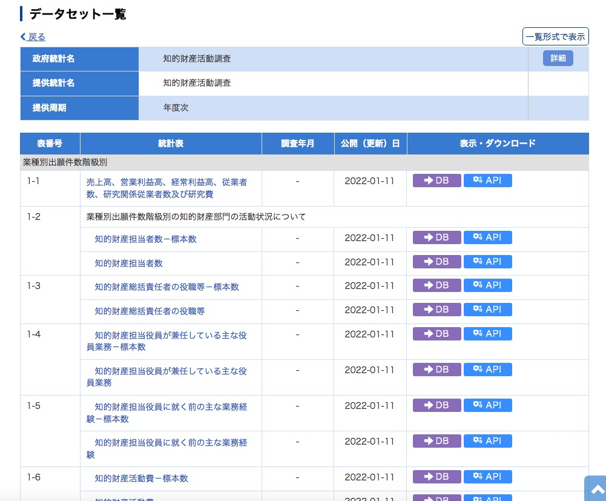
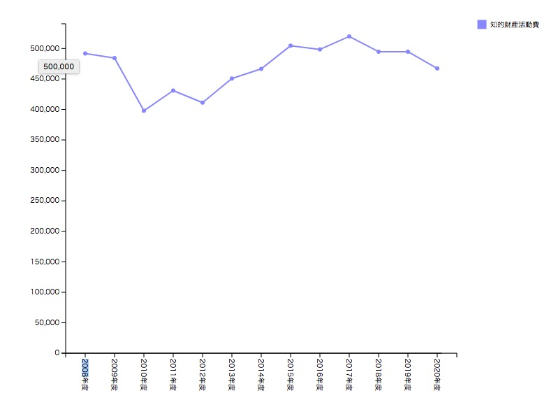

## e-Statで新着一覧を取得しよう
 毎日自動的に処理できるようにしたいので新着一覧を取得する必要があります。  
新着一覧は、リスト取得用のAPIでupdateDateに日付を指定してその日の更新分を取得してくるようにしました。  

```          
wget "https://api.e-stat.go.jp/rest/3.0/app/getSimpleStatsList?updatedDate=20220111&appId=xxxxxxxxxxxx&lang=J" -O new.csv
```          

STAT_CODEが政府統計コード、TABLE_INFがデータセットIDになります。  

```          
"0003254482","00552010","知的財産活動調査","00552","特許庁","知的財産活動調査","","","","","","","","","","","","1-1","業種別出願件数階級別 売上高、営業利益高、経常
利益高、従業者数、研究関係従業者数及び研究費","（注1）各設問項目によって標本数が異なるため、例えば研究関係従業者数の集計結果が従業者数の集計結果を上回るなど、大小関係の逆転が生じ得る点に留意する必要がある。（注2）業種
「個人」において売上高等の記載される場合があるが、これは事業を営む個人事業主が調査票の業種を「個人」として回答したことによる。","業種別出願件数階級別","","","","年
度次","0","2022-01-11","0","該当なし","0","2022-01-11","11","情報通信・科学技術","03","知的財産"
```          


データセットID（TABLE_INF）を使って個別データを取得しましょう。  

```          
wget "http://api.e-stat.go.jp/rest/3.0/app/getSimpleStatsData?appId=xxxxxxxxxxxxxxx&lang=J&statsDataId=0003254482&metaGetFlg=Y&cntGetFlg=N&explanationGetFlg=Y&annotationGetFlg=Y&sectionHeaderFlg=1&replaceSpChars=0" -O 0003254482.csv
```          

## 知的財産活動調査とは

今日の課題は新着一覧に出てきた「知的財産活動調査」をどう処理するか検討してみましょう。  

知的財産活動調査は、我が国における知的財産活動の現状を定量的に把握することを目的とした一般統計調査とのことです。  
特許権などの利用状況を調査したものみたいです。  

 
知的財産活動調査のデータセット数ですが１４０件もあります。  
統計のデータセット数は１つの時もあればこのように１００を超える時もあるみたいです。  
これだけデータセット数が多いとこの中から主要なデータセットを選択してサマリーを作成するのは大変ですね。  


google検索で「知的財産活動調査」の分析記事を調べてみると  

https://www.semiconportal.com/archive/editorial/industry/17.html  
知的財産担当者数は増加傾向にあり、2004年度は、約45,500人で前年度に比べ16.6 ％増加。  
企業等の知的財産活動費は約9,200 億円で前年度に比べ17.1 ％増加。  
特許権の活用状況 国内における2004年度の特許権の利用率は48.2 ％であり、依然として所有する権利の約半数が利用されていないことがわかる。  

https://www.jstage.jst.go.jp/article/jasmin/2018s/0/2018s_246/_article/-char/ja/  
　研究開発活動が利益率に対して最も顕著なプラスの効果を持っていたのは「医薬品製造業」であった．また，研究費投資から利益率向上には25年程度のラグがあることも示された  

「知的財産担当者数」「知的財産活動費」「特許権の利用率」あたりがよく出るキーワードみたいです。  

主要なキーワードの抽出方法なのですが、「知的財産活動調査」のように統計名でgoogle検索した結果に対して、「知的財産担当者数」「知的財産活動費」などのデータセット名で検索して件数が多いものを主要なキーワードとして取り扱うことができるか検討してみたいと思います。  

「利益率」という面白いキーワードがあったのですが、統計の中にはそのままのデータはありませんでした。「経常利益高」という項目があるのでこれを「知的財産活動費」で割り算する必要がありそうです。  
「利益率」が出せそうなら出してみるというのも検討してみると面白いかもしれません。  

主要なキーワードとしては、「知的財産担当者数」「知的財産活動費」「特許権の利用率」のようにその統計に固有のものもありますが、「利益率」「担当者数」「費用」「利用率」など汎用的に重要な項目もあるのかなと思いました。  

データセットの先頭にある「売上高、営業利益高、経常利益高、従業者数、研究関係従業者数及び研究費」は「特許権の利用率」は含まないものの「経常利益高」「知的財産担当者数」「知的財産活動費」を含むものでした。  
データセットが大量にある統計の場合先頭のデータセットはまとめ的なデータになるのでしょうか。他の統計も見てみようと思います。  

データセットの中に「標本数」というものがありました。「標本数」は、アンケート結果の回収数です。データの信用性を図る上では大切な項目ですが、サマリーを作成する際は除外しても良い項目かもしれません。  


 
 
