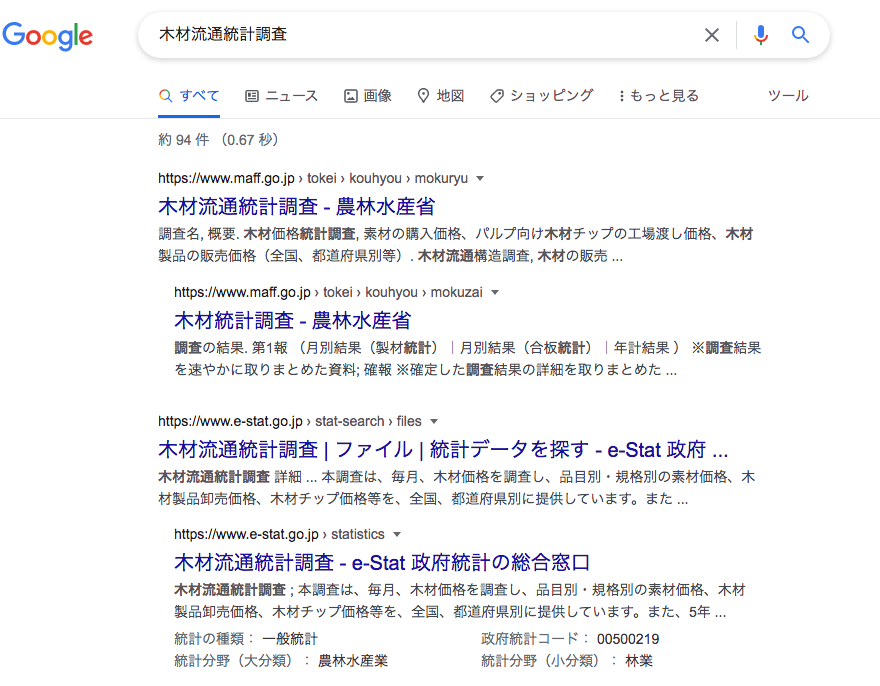

## 統計名でgoogle検索して関心度の高いキーワードを抽出しよう
e-Statの解析の目標として、膨大な統計データの中から一般の人に関心度の高いものを抽出してデータを要約したいと考えています。  
google検索で上位にくるものは関心度が高いと言えるでしょうから統計名でgoogle検索して関心度の高いキーワードを抽出したいと思います。  
google検索を自動でするためにGoogle Custom Search APIを使います。  
Google Custom Search API は１日１００回までは無料で、それ以上だと１０００回につき５ドル課金されるみたいです。  
https://developers.google.com/custom-search/v1/overview#pricing  
１日に発表される統計は10個いかないくらいなので無料の範囲で使えそうです。  
Google Custom Search APIを使ってみましょう。  

## Google Custom Search API を使えるように設定する（2022年1月時点)
以下の手順で設定します。  
・googleアカウントを取得する  
gmailのメールアドレスです。  
・Google Cloud Platformでクレジットカード情報を登録する  
https://console.cloud.google.com/billing/create?hl=ja  
・プロジェクトを作成する  
https://console.cloud.google.com/projectcreate  
・認証情報を作成する  
https://console.cloud.google.com/apis/credentials  
「+認証情報を作成」をクリックして「APIキー」を選択すると  
APIキーが作成されますのでコピーしておきましょう  
・APIキーの利用制限  
キーの制限をクリックしてAPIキーの利用を制限しておきましょう  
接続元が固定のIPアドレスを持っているなら「アプリケーションの制限」でIPアドレスを設定しましょう。  
APIの制限もとりあえすCustom Search API １個にしときます。  
保存ボタンをクリックします  
・Custom Search API を有効にする  
https://console.cloud.google.com/apis/library/customsearch.googleapis.com  
「有効にする」ボタンをクリックします。  
・検索エンジンIDの取得  
https://cse.google.com/create/new  
検索するサイトは「www.google.co.jp（後で削除するので適当で良いです）」  
言語は「日本語」  
検索エンジンの名前は適当で良いです。  
左側の設定ボタンを押すと画面中央中段に「検索エンジンID」があるのでコピーします。  
検索するサイトをで「www.google.co.jp」を「削除」します  
「ウェブ全体を検索」を「オン」にします  

## CurlでGoogle Custom Search API検索する
試しに検索してみましょう。  
curlを利用します。  
curlでAPIキー、検索エンジンID、キーワードを指定して検索します。  
curl 'https://www.googleapis.com/customsearch/v1?key=google apiキー&cx=検索エンジン  ID&q=検索キーワード'  

「木材流通統計調査」で検索してみました。  

curl 'https://www.googleapis.com/customsearch/v1?key=google apiキー&cx=検索エンジンID&q=木材流通統計調査'  

結果はjsonで返ってきます。  
見た感じ、ブラウザのgoogle検索の結果と同じ感じなので良さそうですね。  

```
 "items": [
    {
      "kind": "customsearch#result",
      "title": "木材流通統計調査：農林水産省",
      "htmlTitle": "\u003cb\u003e木材流通統計調査\u003c/b\u003e：農林水産省",
      "link": "https://www.maff.go.jp/j/tokei/kouhyou/mokuryu/",
      "displayLink": "www.maff.go.jp",
      "snippet": "木材流通構造調査, 木材の販売金額、素材及び材料の入荷先別入荷量、製材品、合板及び集成材の出荷先別出荷量、製材用、合単板及び木材チップ製造用機械の所有状況、 ...",
      "htmlSnippet": "\u003cb\u003e木材流通\u003c/b\u003e構造\u003cb\u003e調査\u003c/b\u003e, \u003cb\u003e木材\u003c/b\u003eの販売金額、素材及び材料の入荷先別入荷量、製材品、合板及び集成材の出荷先別出荷量、製材用、合単板及び\u003cb\u003e木材\u003c/b\u003eチップ製造用機械の所有状況、&nbsp;...",
      "cacheId": "cMExMff56bgJ",
      "formattedUrl": "https://www.maff.go.jp/j/tokei/kouhyou/mokuryu/",
      "htmlFormattedUrl": "https://www.maff.go.jp/j/tokei/kouhyou/mokuryu/",
      "pagemap": {
        "cse_thumbnail": [
          {
            "src": "https://encrypted-tbn3.gstatic.com/images?q=tbn:ANd9GcSmlCF9ltcQbjL9DAnpZfJIotIT2ej4cd_YfBfs5ew-v2FR_NxjLAGdFTTI",
            "width": "200",
            "height": "200"
          }
        ],
        "metatags": [
          {
            "viewport": "width=device-width, initial-scale=1",
            "format-detection": "telephone=no"
          }
        ],
        "cse_image": [
          {
            "src": "https://www.maff.go.jp/j/shared_new/shared/images/icon_pnavi@2x.png"
          }
        ]
      }
    },
```
    
 

