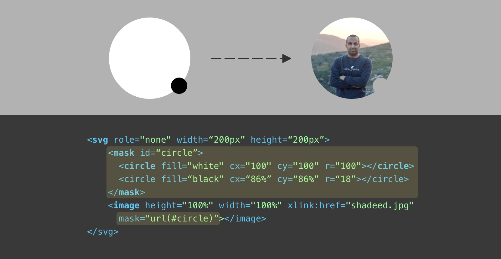
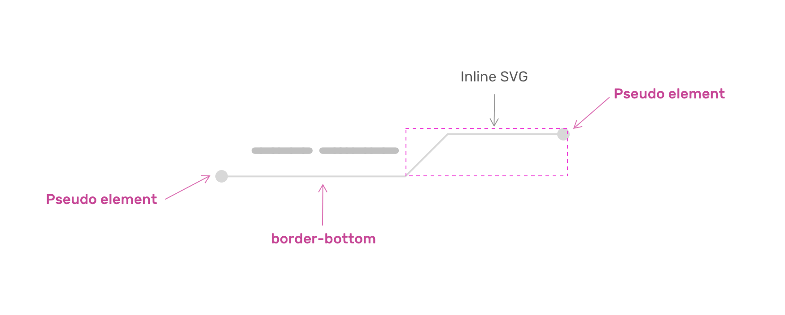
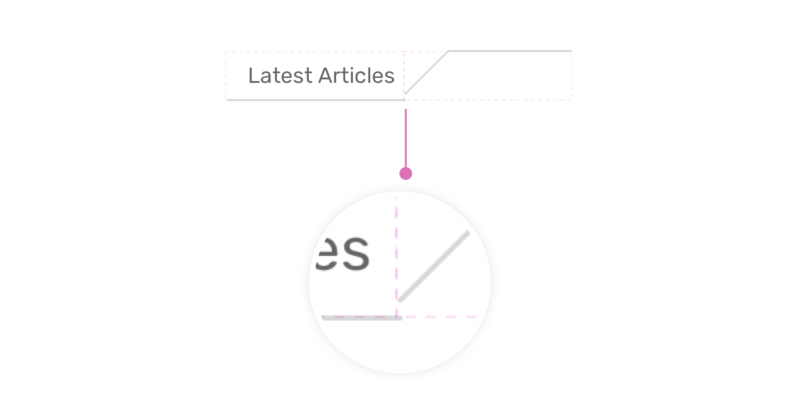
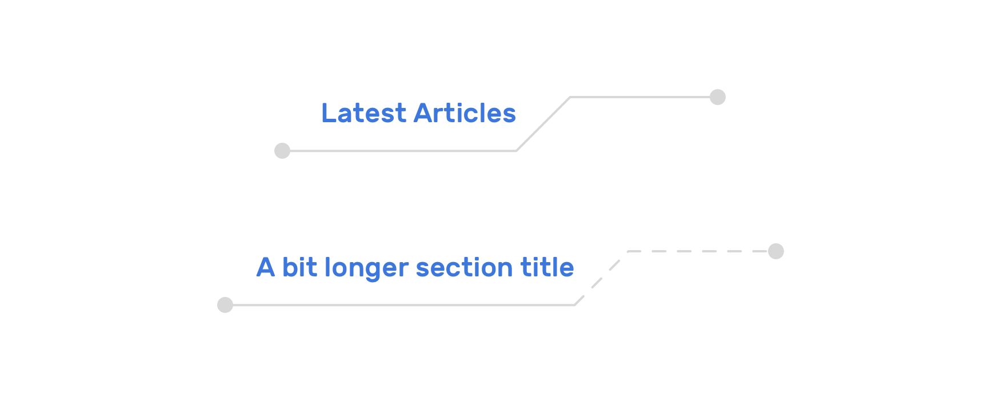
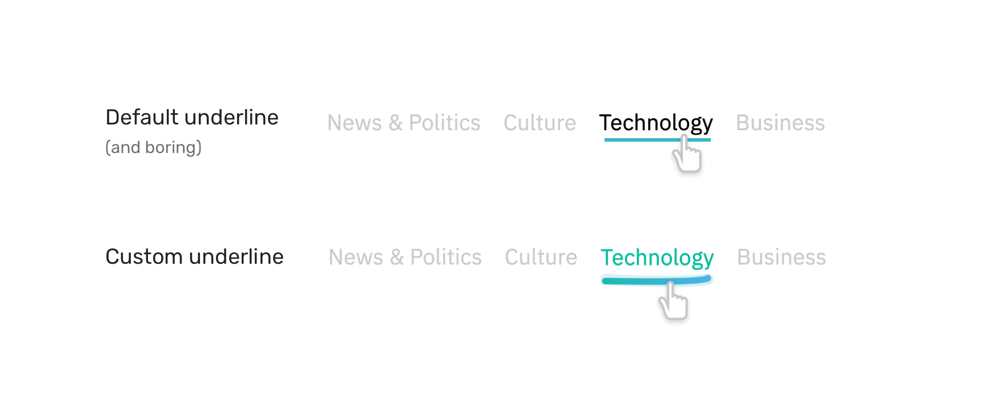
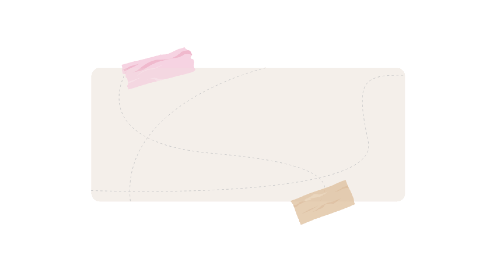
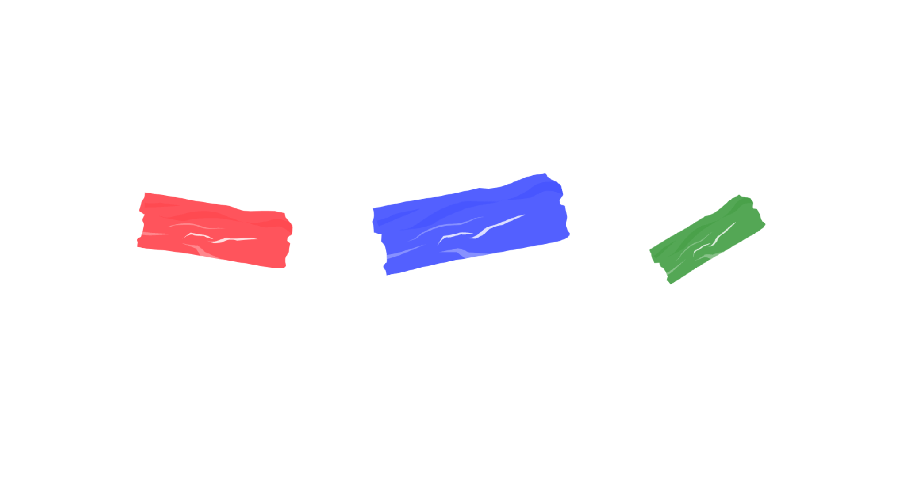

**出典元**：[ Building UI Components With SVG and CSS - Ahmad Shadeed ](https://ishadeed.com/article/building-components-svg-css/)


SVGはアイコンやイラストだけでなく、開発者が時々忘れてしまう隠れた力をたくさん持っています。
CSSと比較してSVGを使用することが非常に理にかなっているユースケースはたくさんあります。たとえば、円形の読み込みアニメーションを作成したり、画像にマスクを適用したりします。このような場合、CSSを使用できないという意味ではありませんが、使用する手法（マスクなど）に基づいてクロスブラウザの問題と戦うのは難しい場合があるため、SVGを使用すると時間と労力を節約できます。

SVGの優れている点は、応答性、パフォーマンス、およびHTML＆CSSを使用してすぐに使用できることです。この記事では、SVGをHTMLおよびCSSとともに使用して特定のUIコンポーネントを構築できるさまざまなユースケースを紹介することを目標としています。

それでは、ユースケースを見てみましょう。


## カットアウトアバター
切り抜かれたアバターは、FacebookのCSSを調べているときに見つけたものです。
メッセンジャーでは、ユーザーアバターにバッジを付けることができ、バッジ用のスペースを割り当てるためにアバターが切り取られます。


これは、CSSの白い境界線を追加することで実行できます（簡単な修正として）が、さらに動的SVGコンポーネントに取り入れてみましょう。


```css
.badge {
  border: 2px solid #ff;
}
```

borderが機能する場合、なぜSVGを使用するのか考えているかもしれませんが、間違いではありません。
しかし、他よりも優れた解決策があります。数学の授業で、教師が問題にさまざまな解決策がある可能性があり、そのうちの1つが柔軟性の点で優れている可能性があると述べたことを覚えていますか？今回の問題もそれと同じです。

とにかく、border の解決策がどのようにすぐに失敗するかを示してみましょう。

失敗例
- ホバー時：カードの背景が変わるため、白い境界線が奇妙に見えます。
- ダークモード：白い境界線は黒っぽい背景の上になります


次の図では、バッジの白い境界線が暗い背景とホバー状態にどのように干渉しているかに注目してください。


ホバー時に境界線colorを変更することでそれを解決できますが、それは最善の解決策とは思えません。


```css
.card__badge {
  border: 2px solid #ff;
}
.card:hover .card__badge {
  border-color: lightgrey;
}
@media (prefers-color-scheme: dark) {
  .card__badge {
    border-color: #454545;
  }
}
```
SVGを使用すると、バッジの下の領域をカットすることで、上記の問題をより適切に解決できます。そうすれば、あらゆる種類のバックグラウンドで機能します。

次の図を見てください。



アバターを含めるためにSVG `<image>`要素を使用しています。バッジ領域を切り取るには、2つの`<circle>`要素を作成する必要があります。1つは白で、もう1つは黒です。
マスクでは、黒で塗りつぶされた要素はすべて非表示になります、白の要素は表示されます。黒い円は、半径18の右下隅に配置されています。
開発者ツールでは、上記は減算と呼ばれます。大きい円から小さい円を引きます。
これが最後のデモです

<script async src="//jsfiddle.net/wyoshi/09f3rqbn/1/embed/html,css,result/dark/"></script>


## タイトルの装飾
あるクライアントのプロジェクトで、SVGとCSSを組み合わせてセクションタイトルをデザイン・構築したことがあります。
セキュリティに関連するブランドなので、このようなスタイルを使うことがあるかもしれません。


コンポーネントは短いタイトルと長いタイトルで動作する必要があり、タイトルが長すぎる場合は、レイアウトを壊さずに複数の行に折り返す必要があります。
それを構築するためには、以下のような対応が必要です。

- 最初に、固定部分（右側）をコピーして、インラインSVGとして追加する。
- CSSを使用して、タイトルの下に行を作成しました。また、行の最初と最後にある小さな円にも使用。
- 不要なポジショニングを使用しないように、flexboxを使用してコンポーネントレイアウトを作成。



それでは基本的なHTMLとCSSから始めましょう。


```html
<h2 class="c-section__title">
  <span>CSS is awesome</span>
  <svg xmlns="http://www.w3.org/2000/svg" width="128" height="34.5" viewBox="0 0 128 34.5" preserveAspectRatio="none">
    <path fill="none" stroke="#d8d8d8" stroke-width="2" d="M127 1H33.5L1 33.5"></path>
  </svg>
</h2>
```
```css
.c-section__title {
  max-width: 700px;
  width: fit-content;
  display: flex;
  margin-left: auto;
  margin-right: auto;
}
```


次のステップでは、`span` 要素の下にボーダーを追加して、SVGに接続された線を追加したいと思います。



SVGが回線に接続されていないことに気づきました。
`flexbox`を使用しているので、修正するのは簡単です。`flex-item` を`flex-end`に揃える必要があります。


```css
.c-section__title {
  max-width: 700px;
  width: fit-content;
  display: flex;
  align-items: flex-end;
  margin-left: auto;
  margin-right: auto;
}
```

次に、絶対位置指定で擬似要素を使って、最初と最後に円を追加する必要があります。

<script async src="//jsfiddle.net/wyoshi/j4pydfmb/1/embed/html,css,result/dark/"></script>


また、SVGを使うと何がいいかというと、SVGのパスを点線にして、アニメーションさせることができるのです。
そのためには、SVGで書き出されたパスがアウトライン化されていないことを確認する必要があります。

```html
<path d="M127 1H33.5L1 33.5" fill="none" stroke="#d8d8d8" stroke-width="2"></path>
```

このテクニックは、Jake Archibald氏の[素晴らしい記事](https://jakearchibald.com/2013/animated-line-drawing-svg/) から学びました。このアイデアは、パスの長さを求めるというものです。


Chrome DevToolsで、SVGを検査し、`<path>`要素を選択すると、その末尾の横に`== $0`と表示されることがわかります。これを選択したまま、コンソールに移動し、以下のスクリプトを記述します。

```javascript
$0.getTotalLength()
// 139.46
```


このようなことをしなくても、DOMから要素を選択するには、`$0`が手っ取り早いです。

```javascript
let sectionPath = document.querySelector('#path');
console.log(sectionPath.getTotalLength());
```

それはこの例の文脈の中での簡単なヒントでした。

さて、長さが決まったら、あとは好きなようにやってみましょう。例えば、ホバー時にアニメーションさせることができます。


```css
.c-section__title--dashed path {
  stroke-dasharray: 139;
  stroke-dashoffset: 0;
  transition: 0.7s;
}
.c-section__title--dashed:hover path {
  stroke-dashoffset: 139;
}
```

または、単純に点線に変えることもできます（この場合、パスの長さを知る必要はありません）。



<script async src="//jsfiddle.net/wyoshi/wp9k7Lb6/1/embed/html,css,result/dark/"></script>

## SVGを使ったカスタムリンクの下線

SVGを使って、ワクワクするようなカスタムリンクのアンダーラインを作成することができます。私は数年前に、ランダムにパスを生成し、ホバー時にそれを再描画するスクリプトを作成しました。

次の図で、プレビューの前と後を考えてみてください。



アイデアは、各リンクにSVGを挿入することであり、次のようになります。

```html
<svg width="400" height="35" xmlns="http://www.w3.org/2000/svg">
  <path id="pathItem"
    d="M5 5 Q 30 15 170 5"
    stroke="black"
    fill="transparent"
    stroke-width="7"
    stroke-linecap="round"/>
</svg>
```

この手法は `d` 属性値を変更することによって起こります。これは、パスが実際にどのように描画されるかを示すビジュアルです。

<script async src="//jsfiddle.net/wyoshi/670razvf/7/embed/"></script>

## カスタムSVGテープ

クライアントのプロジェクトに携わっているとき、CSSでどこにでも配置可能で、1つのCSS変数のみで色を変更できるほどダイナミックな方法で、テープをセクションに取り付ける方法が必要でした。

次の図を考えて見ましょう。



Adobe Illustratorで、テープをレイヤーに分割しました。

- ベース：塗りつぶしの色を取ります
- 透明な黒：暗い領域を示します
- 透明な白：明るい領域を示します


SVGコードを見てみましょう。


```html
<svg>
  <defs>
    <g id="tape" fill="currentColor">
      <!-- path contents -->
    </g>
  </defs>
</svg>
```

`fill=currentColor`を追加したことに注意してください。
`currentColor`キーワードは、CSS `color` プロパティから値を継承するため、1つのプロパティのみを使用して色を動的に変更できます。
単色のベースと、明るい領域と暗い領域に他の2つのレイヤーがあることを考えると、色を変更すると、テープの外観が異なります。



さらに良いことに、SVGをテンプレートに変換し、`<use>` SVG要素の助けを借りて、SVGを複製せずにテープを再利用することができます。


```html
<svg style="display: none;">
  <defs>
    <g id="tape" fill="currentColor">
      <!-- path contents -->
    </g>
  </defs>
</svg>
<!-- An example of using the tape from a template -->
<svg class="tape" style="--angle: 10deg; color: red; --size: 120px;" aria-hidden="true" focusable="false" viewBox="0 0 123 47">
  <use href="#tape"></use>
</svg>
```

`<use>`要素を介してテープを追加した方法に注目してください。これの良いところは、CSS変数をインラインスタイルとして使用することです。
  CSSは次のようになります。

```css
.tape {
  width: var(--size);
  transform: rotate(var(--angle));
}
```

<script async src="//jsfiddle.net/wyoshi/1jrL4cg6/8/embed/html,css,result/dark/"></script>


## まとめ
SVGを使用してUIコンポーネントを構築すると、作業がより簡単かつ簡単になります。一部のUIコンポーネントは、100％完璧なユースケースやSVG（アバターカットアウトなど）ではない場合がありますが、作業しているプロジェクトのコンテキストによって異なります。

## おすすめの書籍
{}

{}
