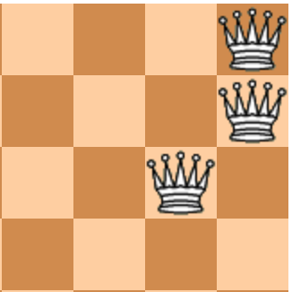

## グローバル変数
今回は、前回からの引き続きでブルートフォース力任せ探索のプログラムの詳細部分を説明します。    

プログラムのソースは以下のURLをご覧ください。  

https://github.com/suzukiiichiro/N-Queens/blob/master/03Python/py01_nqueen.py      

まず、グローバル変数を見ていきましょう。  

417~420行目で設定しています。  
 
417行目 MAX、418行目 SIZEでNの数を指定します。  
プログラムは8ですが、動作を説明するために4に変更してみてください。  

```
MAX = 4
SIZE = 4

``` 
以降はN=4の問題として説明します。  

419行目 ABOARDという配列を宣言しクイーンを置いていきます。  
ABOARD = [0 for i in range(MAX)]で4個の要素を0で初期化しています。  
ABOARD = [0,0,0,0] と同じです。  
 
ABOARD[0]は1行目のクイーンを置く位置です0から3までの数字が入ります。  
ABOARD[0]が3だと右から4番目にクイーンを置く感じになります。  
 
420行目 COUNT=0 でCOUNTを初期化しています。  

## nqueenメソッド
グローバル変数の宣言が終わったら441行目でnqueenメソッドが呼び出されます。  

439行目でnqueenメソッドを再帰的に呼び出しているのが最も特徴的です。  

全体の動作については次の「再帰について」で図を交えて説明しますが前提として各行が何をしているか押さえましょう。  

```
 global ABOARD
```
433行目で global ABOARDとして変数宣言しています。  
関数内でグローバル変数に値を代入したい場合は、変数宣言時にglobalをつける必要があります。  
globalをつけないとローカル変数として扱われます。  
ちなみに、私は試しに433行目を削除して実行してみたのですがエラーになりました。  

```
 if row is SIZE:
   printout()              
```
434行目 if row is SIZE: はrowイコールSIZEという意味です。  
if row == SIZE: としても今回は同じ動きになります。  

434-435行でやっていることは434行目のif文で最終行までクイーンを置き終わっているかどうかを判定し置き終わっていたらprintoutメソッドを呼び出してCOUNT数と各行のクイーンの設置場所を出力します。  


```
  for i in range(SIZE)
```
437行目 for i in range(SIZE) は0からスタートしてSIZEの回数分0,1,2,3と1ずつインクリメントしながらfor文を回します。  
やっていることは各行にクイーンを設置する場所を右から左に1個ずつずらしています。1番左端までいったらfor文を抜けます。  


```
  ABOARD[row] = i
```
438行目のABOARD[row]=iでクイーンを設置しています。  
rowは行を意味します。0からスタートして0,1,2,3まであります。  
例えば、0だと1行目、3だと4行目となります。  

iはクイーンを設置する列になります。  
0からスタートして0,1,2,3まであります。  
例えば、0だと右から1列目、3だと右から4列目となります。  

例えばABOARD[2]=3 の場合は  
3行目は右から4列目にクイーンを置くことになります。  

```
  nqueen(row+1)
```
439行目のnqueen(row+1)で再帰的にnqueenメソッドを呼び出しています。  
やっていることは次の行への移動です。
  

## 再帰の動きについて

再帰の基本的な動作で押さえたいのは以下の2つです。  
・再帰を呼び出した時の動作  
通常のメソッド呼び出しと同じです。メソッドの先頭に移動します。引数に渡された値が反映されます。  
・再帰から抜ける時の動作  
再帰から抜けると1階層前に戻り再帰を呼び出した場所の次の行に移動します。
変数の状態は再帰を呼び出す直前の状態に戻ります。  

再帰の呼び出しが実際にどういう動きになっているかは頭で考えても難しいので図を見ながら説明します。  

444行目でnqueenを0を渡して呼び出します(1階層目)。  
432行目からスタートして  
row=0なので436行目のelse:に行きそのまま437行目のfor文に入ります  
最初のfor文なのでi=0です。  
row=0なので  
ABOARD[0]=0  
で  
1行目の右端にクイーンを置きます。  

 

439行目で再帰的にnqueenを呼び出します。  
row=0 row+1=1なので  
nqueenを引数1を渡して呼び出します(2階層目)  
432行目からスタートして  
row=1なので436行目のelse:に行きそのまま437行目のfor文に入ります  
最初のfor文なのでi=0です。  
さっきもfor文が出てきましたが再帰は階層ごとにローカル変数を別に考える必要があります。  
row=1なので  
ABOARD[1]=0  
で  
2行目の右端にクイーンを置きます。  

 

439行目で再帰的にnqueenを引数2を渡して呼び出します(3階層目)。  
同様にfor文に入り、i=0 row=2なので  
ABOARD[2]=0  
で  
3行目の右端にクイーンを置きます。  

 

439行目で再帰的にnqueenを引数3を渡して呼び出します(4階層目)。  

同様にfor文に入り、i=0 row=3なので  
ABOARD[3]=0  
で  
4行目の右端にクイーンを置きます。  

 

439行目で再帰的にnqueenを引数4を渡して呼び出します(5階層目)。  

row=4なのでif row is SIZE:でprintout()メソッドを呼び出してCOUNTと各行のクイーンの位置を出力します。  
printout()後再帰から抜けて4階層目の439行目の後ろに移動します。  
変数は再帰を呼び出す直前のものに戻るのでrowは3 iは0になります。  

for文の中にあるのでiを1インクリメントしてiは1になり次のfor文に移動します。  
 _
ABOARD[3]=1  
で  
4行目の右から2番目にクイーンを置きます。  

 

439行目で再帰的にnqueenを引数4を渡して呼び出します(5階層目)。  
row=4 なのでprintout()して再帰から抜けて4階層目の439行目の後ろに移動します。  

for文の中にあるのでiを1インクリメントしてiは2になり次のfor文に移動します。  
 _
ABOARD[3]=2  
で  
4行目の右から3番目にクイーンを置きます。  
 
 
 
439行目で再帰的にnqueenを引数4を渡して呼び出します(5階層目)。  
row=4 なのでprintout()して再帰から抜けて4階層目の439行目の後ろに移動します。  

for文の中にあるのでiを1インクリメントしてiは3になり次のfor文に移動します。  
 _
ABOARD[3]=3  
で  
4行目の右から4番目にクイーンを置きます。  

 

439行目で再帰的にnqueenを引数4を渡して呼び出します(5階層目)。  
row=4 なのでprintout()して再帰から抜けて4階層目の439行目の後ろに移動します。  
for文でiを1インクリメントすると4ですがrange(4)だと0,1,2,3までなのでここでfor文を抜けます。  

for文を抜けると439行目には移動しないので再帰から抜けて3階層目の439行目に移動します。  

3階層目ではrow=2 iは0です。  
for文の中にあるのでiを1インクリメントしてiは1になり次のfor文に移動します。  

ABOARD[2]=1  

 

439行目で再帰的にnqueenを引数3を渡して呼び出します(4階層目)。  

row=3なので436行目のelse:に行きそのまま437行目のfor文に入ります  
最初のfor文なのでi=0です。  

ABOARD[3]=0  

 

439行目で再帰的にnqueenを引数4を渡して呼び出します(5階層目)。  
row=4 なのでprintout()して再帰から抜けて4階層目の439行目の後ろに移動します。  
という感じで下の階層からfor文でぐるぐる回転しながらうごいてゆきます。  
