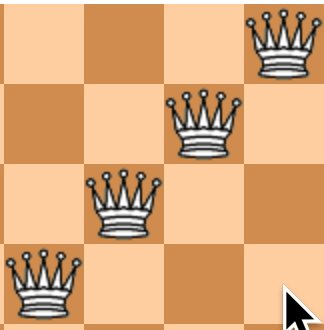

## 配置フラグ（制約テスト高速化） 
 前回は全くアルゴリズムを使わないで全パターン１行に１つずつクイーンを設置するブルートフォース　力任せ探索でした。  
エイトクイーン(N=8)ですら凄く時間がかかることが体感できたかと思います。  

今回も解を出すまでには至りませんが、一つ進んで、配置フラグ（制約テスト高速化）を使いより効率よく解の候補を列挙する方法を説明したいと思います。  

エイトクイーン問題はクイーンの利き筋上下左右斜め８方向にクイーンを置けないという制約があるのですが、今回は「上下の制約」すなわち、同じ列にはクイーンを置けないという制約を配置フラグを使って追加してみます。  

例えば、  
1行目で右端にクイーンを置くと以降の行では右端にクイーンを置けなくなります。  
 
上の図だと2行目で1行目ですでにクイーンを置いている右端にクイーンを置こうとしているのでNGです。  
 
上の図は2行目は良いのですが3行目で1行目にすでにクイーンを置いている右端にクイーンを置こうとしているのでNGです。  

 

 

上の２つの図のように同じ列にクイーンを置かないパターンを探索します。  

配置フラグ（制約テスト高速化）を使って私の端末でエイトクイーン(N=8)を実行すると、0m0.554sかかります。ブルートフォースが3m7.321sかかったので360倍くらい速いですね。  

## グローバル変数について
それではプログラムについて説明していきましょう。  

プログラムソースは以下のURLにあります。  

https://github.com/suzukiiichiro/N-Queens/blob/master/03Python/py02_nqueen.py

プログラムの作りとしては前回のブルートフォースをベースにしてそこに配置フラグを追加したものとなりますので、ブルートフォースとの差異を説明していきたいと思います。  

まず、グローバル変数について説明します。  
今回も動作をわかりやすくするため419,420行目のMAXとSIZEを4に変更してみてください。  

423行目 配列 FA がグローバル変数として新しく追加されています。  
0 for i in range(SIZE) で0に初期化しています。  
どの列にクイーンを置いたかをフラグで管理します。  
FA[0]が右端,FA[1]が右端から2番目,FA[2]が右端から3番目,FA[3]が右端から4番目(左端)になります。  
例えば2列目にクイーンを置くとFA[1]=1にしてフラグを立てます。  

## nqueenメソッドについて
nqueenメソッドの作りも基本的に前回のブルートフォースと同じです。  
443行目〜446行目に配置フラグFAの処理が追加されているところが違う部分となります。  

442行目 ABOARD[row]=i でクイーンを設置します。  
前回のブルートフォースの場合は  
無条件で次の行でnqueen(row+1)で再帰的にnqueenを呼び出していました。    
今回の配置フラグでは  
443行目 if FA[i] == 0: の条件を満たした場合だけ再帰的にnqueenを呼び出しています。  

iは今回クイーンを置いた場所を意味します。  

444行目でクイーンを置いた列の配置フラグをあらかじめ1にしておきます。  

例えば以下の図の様な場合  

 
1行目では右端にクイーンを置くので、  
444行目の処理でFA[0]=1となります。  
2行目は右端から2番目にクイーンを置くので、  
FA[1]=1となります。  
3行目は右端にクイーンを置いているのでiは0です。  
443行目の if FA[i]== 0 : の判定で  
FA[0]は1ですので443行目から446行目の処理には入らず次のfor文に移動することになります。  

この443,444,446行目の処理によってすでに同じ列にクイーンを置いている場合は下の行に行くのをやめるという動きを実現しています。  

446行目でFA[i]=0 という処理があります。
この処理は再帰の動きを理解する上で非常に重要な処理になります。  
再帰から戻ってきた時は445行目の下からスタートすることになります。  
再帰から戻ってきた時は変数の状態を再帰に入る直前の状態に戻す必要があります。
ローカル変数については特別にプログラムしないでも再帰前の状態に戻るのですが、グローバル変数は自分で設定しないと元に戻りません。  
再帰から戻ってきた時はiにクイーンを置かなかったことになるのですから  
FA[i]=0で明示的にフラグを落としてあげています。  

今回は配置フラグの全体的な流れを説明しました。次回は図で説明しながら実際の動きを追ってみましょう。  

