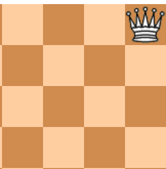
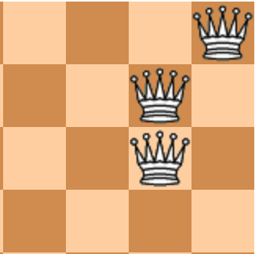
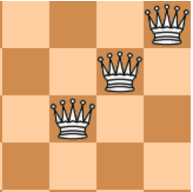
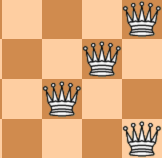
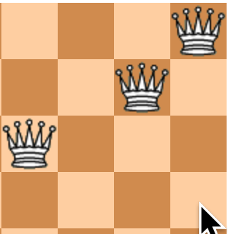
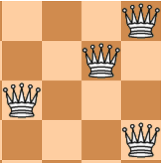
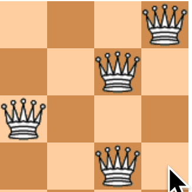

## 配置フラグ（制約テスト高速化）
 今回も引き続き配置フラグ（制約テスト高速化）を説明していきたいと思います。    
 前回はプログラムの概要を説明しましたが、今回はnqueenメソッドの再帰と配置フラグの動きについて図で示しながら説明していきたいとおもいます。  

プログラムソースは以下のURLにあります。  

https://github.com/suzukiiichiro/N-Queens/blob/master/03Python/py02_nqueen.py  

プログラムはエイトクイーン(N=8)ですが説明をしやすくするため4x4のN=4で説明します。実際に動かしてプログラムの動作を確認したい方は419,420行目のMAXとSIZEを4に変更してみてください。    

## おさらい
ブルートフォースからのおさらいとして次の点を押さえておきましょう。  
・442行目のABOARD[row]=i はクイーンを配置する動きです。  
・445行目のnqueen(row+1)は再帰でnqueenメソッドを動かしていますがこれは次の行に進む動きです。  
・438,439は最終行(4行目)までクイーンを置ききった後にCOUNT と各行にクイーンを置いた場所を出力します。  
再帰でnqueenメソッドを呼び出したときは、当然のことなのですがメソッドの先頭435行目に移動します。  
引数で渡されたrow以外のローカル変数はすべて初期化された状態になります。  

・再帰から抜ける部分は2箇所あります。  
一つ目は、438,439行目で最終行(4行目)までクイーンを置ききった後にprintoutする時  

二つ目は、441行目のfor文がSIZE数の数(N=4だと3)だけ回りきったあとです。  

再帰から抜けたときは再帰を呼び出した445行目のすぐ後ろからスタートします。  
ローカル変数の状態は再帰を呼び出す直前の状態になります。  
1行前に戻るような動きとなります。  

ちなみに441行目のfor i in range(SIZE)は右端から左端に1個ずつクイーンを置こうとする動きです。  
左端までクイーンを置ききったらfor文を抜けるイメージです。  

## nqueen メソッドの動き
448行目のnqueen(0)からスタートします。  
メソッドの先頭435行目に移動します。  
row=0なので440行目の else: に移動します。  
441行目のfor文に入りi=0からスタートします。  
442行目のABOARD[0]=0で1行目の右端にクイーンを設置します。  
 
1個目のクイーンなので当然配置フラグはどれもOの状態ですから443行目のif FA[0] == 0 の条件を満たしてif文の中に入ります。  
 右端にクイーンを置いたのですから444行目でFA[0]=1 で右端の位置にフラグをたてます。  
445行目でnqueenを引数1を渡して呼び出して2行目に進みます。  

再帰呼び出しなのでrow=1の状態でメソッドの先頭435行目に移動します。  
row=1なので440行目の else: に移動します。  
441行目のfor文に入りi=0からスタートします。  
442行目のABOARD[1]=0で2行目の右端にクイーンを設置します。  
 
1行目で既に右端にクイーンを設置していますのでFA[0]は1になりますので443行目のif FA[i]==0の条件を満たしません。  
if文に入らずに次のfor文に進みます。  

この部分が今回追加された配置フラグの制御になります。  
この処理のおかげで上下の利き筋に引っかかる場合は次の行に移動するのをやめ探索を効率化することができます。  

441行目で次のfor文に進みi=1となります。  

442行目のABOARD[1]=1で2行目の右から2列目にクイーンを設置します。  
 

1行目で右端にクイーンを置いているのでFAの状態は以下のとおりです。  

```
FA[0]==1
FA[1]==0
FA[2]==0
FA[3]==0
```
FA[1]は0なのでif FA[i]==0の条件を満たすのでif 文の中に入ります。  

 右端から2列目にクイーンを置いたのですから444行目でFA[1]=1 で右端から2番目の位置にフラグをたてます。  
445行目でnqueenを引数2を渡して呼び出して3行目に進みます。  

再帰呼び出しなのでrow=2の状態でメソッドの先頭435行目に移動します。  
row=2なので440行目の else: に移動します。  
441行目のfor文に入りi=0からスタートします。  
442行目のABOARD[2]=0で3行目の右端にクイーンを設置します。  
 

1行目で右端に、2行目で右から2列目にクイーンを置いているのでFAの状態は以下のとおりです。  

```
FA[0]==1
FA[1]==1
FA[2]==0
FA[3]==0
```
i=0 FA[0]=1なのでif FA[i]==0の条件を満たさずに次のfor文に進みます。  


441行目で次のfor文に進みi=1となります。  
442行目のABOARD[2]=1で3行目の右から2列目にクイーンを設置します。  
 

1行目で右端に、2行目で右から2列目にクイーンを置いているのでFAの状態は以下のとおりです。  

```
FA[0]==1
FA[1]==1
FA[2]==0
FA[3]==0
```
i=1 FA[1]=1なのでif FA[i]==0の条件を満たさずに次のfor文に進みます。  

441行目で次のfor文に進みi=2となります。  
442行目のABOARD[2]=2で3行目の右から3列目にクイーンを設置します。  
 
```
FA[0]==1
FA[1]==1
FA[2]==0
FA[3]==0
```
i=2 FA[2]=0なのでif FA[i]==0の条件を満たすのでif文の中に入ります。  
 右端から3列目にクイーンを置いたのですから444行目でFA[2]=1 で右から3列目の位置にフラグをたてます。  
445行目でnqueenを引数3を渡して呼び出して4行目に進みます。  

再帰呼び出しなのでrow=3の状態でメソッドの先頭435行目に移動します。  
row=3なので440行目の else: に移動します。  
441行目のfor文に入りi=0からスタートします。  
for文の中で右端から左端へ順番にクイーンを置いていくことになりますが。  
すでに、1行目で右端、2行目で右から2列目、3行目で右から3列目にクイーンを設置しています。  
FAの状態を見てみると以下の通りです。  

```
FA[0]==1
FA[1]==1
FA[2]==1
FA[3]==0
```
そのためiが0,1,2の時は443行目の配置フラグの制約に引っかかりif文の中には入らず次のfor文に進みます。  


 
 
 

i=3では  
ABOARD[3]=3で4行目の左端にクイーンを設置します。  
 
やっとフラグの制約に引っかからず443行のif文の中にはいれます。  

FA[3]=1  
444行目でFA[3]=1 で右から4番目の位置にフラグをたてます。  
445行目でnqueenを引数4を渡して呼び出して先に進みます。  

再帰呼び出しなのでrow=4の状態でメソッドの先頭435行目に移動します。  
row=4なので438行目の if row == SIZE:の条件を満たします。  
439でprintout()メソッドを呼び出してCOUNT と各行のクイーンの設置場所を出力します。  

そして、再帰を抜け4行目の処理（row=3）に戻ります。  
戻る場所は445行目のすぐ下です。  
ローカル変数は再帰を呼び出す直前の状態にもどっています。  
row=3 i=3です。  
446行目でFA[3]=0 でフラグを落としています。  
グローバル変数は再帰からもどっても再帰を呼び出す直前の状態に自動的にはもどらないので明示的にフラグを落とす必要があります。  

446行目でフラグを落としたあと次のfor文に進むのですが、すでにi=3なのでfor文を抜けます。  
for文を抜けると再帰を抜け3行目の処理(row=2)に戻ります。  
ここではrow=4,row=3と立て続けに再帰をぬけrow=2に戻る形となります。  

戻る場所は445行目のすぐ下です。  
ローカル変数は再帰を呼び出す直前の状態にもどっています。  
3行目はforは0,1,2まで進んでいました。  
row=2 i=2です。  
446行目でFA[2]=0 でフラグを落としています。  
そして次のfor文に進みます。  
i=3で  
ABOARD[2]=3で3行目の左端にクイーンを設置します。  
 
FAの状態を見てみると以下の通りです。  

```
FA[0]==1
FA[1]==1
FA[2]==0
FA[3]==0
```
FA[3]=0なのでif FA[i]==0:の条件を満たしてif 文の中に入ります。  
右から4列目にクイーンを置いているので444行目でFA[3]=1 でフラグをたてます。  
445行目でnqueenを引数3を渡して呼び出して先に進みます。  

再帰呼び出しなのでrow=3の状態でメソッドの先頭435行目に移動します。  
row=3なので440行目の else: に移動します。  
441行目のfor文に入りi=0からスタートします。  
for文の中で右端から左端へ順番にクイーンを置いていくことになりますが。  
すでに、1行目で右端、2行目で右から2番目、3行目で右から4番目にクイーンを設置しています。  
FAの状態を見てみると以下の通りです。  

```
FA[0]==1
FA[1]==1
FA[2]==0
FA[3]==1
```
そのためiが0,1の時は443行目の配置フラグの制約に引っかかりif文の中には入らず次のfor文に進みます。  


 
 

i=2では  
ABOARD[3]=2で4行目の右から3列目にクイーンを設置します。  
 
やっとフラグの制約に引っかからず443行のif文の中にはいれます。  

FA[2]=1  
444行目でFA[2]=1 で右から3列目の位置にフラグをたてます。  
445行目でnqueenを引数4を渡して呼び出して先に進みます。  

再帰呼び出しなのでrow=4の状態でメソッドの先頭435行目に移動します。  
row=4なので438行目の if row == SIZE:の条件を満たします。  
439でprintout()メソッドを呼び出してCOUNT と各行のクイーンの設置場所を出力します。  

細く動作をみていくとこんな感じになります。  
ブルートフォースの時は無条件に再帰的にnqueenメソッドを呼び出し次の行にいっていましたが制約フラグを使うことによって無駄に深い階層にもぐっていくことを大分防止できていることがわかると思います。  
