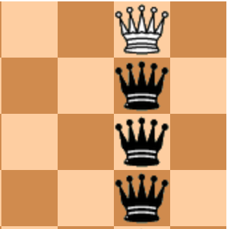
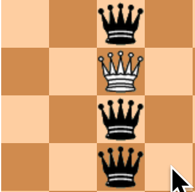
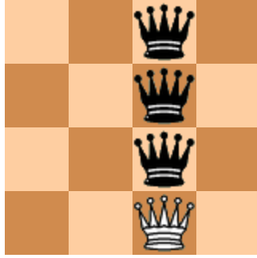
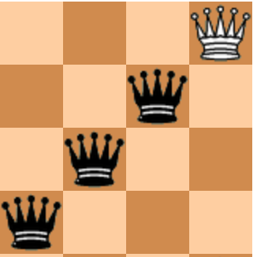
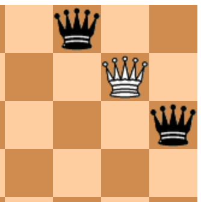

## バックトラック 
 今回はバックトラックを説明していきたいと思います。      
 今回のバックトラックのロジックは前回の配置フラグの拡張版です。  
 配置フラグは上下の利き筋までしかチェックしていませんでしたが今回のバックトラックは左右斜めの対角線上の利き筋もチェックします。  
上下の配置フラグの他に右斜め、左斜めの配置フラグを作ってチェックします。  
ブルートフォース、配置フラグでは解の候補を出すに止まりましたが、今回で左右、上下、対角線上とクイーンのすべての利き筋をチェックすることができるますので、プログラム独力で解を出せるようになります。  
出力は解の数となっております。  

ブルートフォース、配置フラグ、バックトラックの関係は以下の通りです。  
制約が1個、2個、3個と追加されていくような感じです。

・ブルートフォース  
制約1個目 1行に1個のクイーンを置く 左右の利き筋をみる  
・配置フラグ  
制約1個目 1行に1個のクイーンを置く 左右の利き筋をみる  
制約2個目 配置フラグで同じ列にクイーンを置けないようにする 上下の利き筋をみる  
・バックトラック  
制約1個目 1行に1個のクイーンを置く 左右の利き筋をみる  
制約2個目 配置フラグで同じ列にクイーンを置けないようにする 上下の利き筋をみる  
制約3個目 配置フラグを拡張し左右斜めにクイーンを置けないようにする 対角線上の利き筋をみる  

プログラムソースは以下のURLにあります。    

https://github.com/suzukiiichiro/N-Queens/blob/master/03Python/py03_nqueen.py    
## グローバル変数
432,433行目でTOTAL,UNIQUEというグローバル変数が追加されています。  
ブルートフォース、配置フラグは解の候補を列挙するにとどまっていましたが、今回からはプログラム内で正解数を出力するようになります。  
TOTALは正解数の総数です。  
UNIQUEですが、NQueenの解は左右ミラー反転、90度、180度、270度と左右反転していくと同じ形のものが結構あります。左右反転して同じ形のものを同一解としてカウントした数がUNIQUEとなります。  

436,437行目にFB,FC配列が追加されています。  
FBが左斜め、FCが右斜めの対角線の利き筋を配置フラグでチェックします。  

## 対角線上の配置フラグ

対角線の利き筋ですが１次元配列でチェックすることができます。  
図で見てみましょう。  

上下の利き筋について簡単です。  
例えば、1行目の右から2列目にクイーンを置いた場合は2、3、4行目の2列目にクイーンを置けなくなります。  

 

2、3、4行目の右から2列目にクイーンを置いた場合はその他の行の2列目にクイーンを置けなくなります。  

 
 
 

ですのでフラグはクイーンを置いた列番号に立てれば良いことになります。  
2列目だったらFA[1]=1です。  

対角線の利き筋についても計算が必要ではあるのですが法則性があり1次元配列で表現することが可能です。  

FB 左斜め対角線の利き筋について見てみましょう  

左斜め対角線のフラグの位置の計算法則は
行数-クイーンを置いた列数+(サイズ-1)  
row-i+(size-1)  
で1次元配列で表現できます。  

図で見てみましょう。  
1行目の1列目にクイーンを置いた場合  
左斜め対角線の利き筋は以下の通りになります。  

```
1行目1列目 [0,0]
2行目2列目 [1,1]
3行目3列目 [2,2]
4行目4列目 [3,3]
```

 

row-i+(size-1) で計算してみましょう  

```
1行目1列目 [0,0] 0-0+(4-1)=3
2行目2列目 [1,1] 1-1+(4-1)=3
3行目3列目 [2,2] 2-2+(4-1)=3
4行目4列目 [3,3] 3-3+(4-1)=3
```

FB[4] にフラグをたてれば左対角線の利き筋をチェックすることができます。 

2行目3列目にクイーンを置いた場合はどうなるでしょう  

左斜め対角線の利き筋は以下の通りになります。  

```
1行目2列目 [0,1]
2行目3列目 [1,2]
3行目4列目 [2,3]
```

 

row-i+(size-1) で計算してみましょう  

```
1行目2列目 [0,1] 0-1+(4-1)=2
2行目3列目 [1,2] 1-2+(4-1)=2
3行目4列目 [2,3] 2-3+(4-1)=2
```
FB[3] にフラグをたてれば左対角線の利き筋をチェックすることができます。 

FC 右斜め対角線の利き筋について見てみましょう  

右斜め対角線のフラグの位置の計算法則は
行数+クイーンを置いた列数  
row+i  
で1次元配列で表現できます。  

図で見てみましょう。  
1行目の4列目にクイーンを置いた場合  
右斜め対角線の利き筋は以下の通りになります。  

```
1行目1列目 [0,3]
2行目2列目 [1,2]
3行目3列目 [2,1]
4行目4列目 [3,0]
```

 

row+iで計算してみましょう  

```
1行目1列目 [0,3] 0+3=3
2行目2列目 [1,2] 1+2=3
3行目3列目 [2,1] 2+1=3
4行目4列目 [3,0] 3+0=3
```

FC[4] にフラグをたてれば右対角線の利き筋をチェックすることができます。 

2行目の2列目にクイーンを置いた場合  
右斜め対角線の利き筋は以下の通りになります。  

```
1行目1列目 [0,2]
2行目2列目 [1,1]
3行目3列目 [2,0]
```

 

row+iで計算してみましょう  

```
1行目1列目 [0,2] 0+2=2
2行目2列目 [1,1] 1+1=2
3行目3列目 [2,0] 2+0=2
```

FC[3] にフラグをたてれば右対角線の利き筋をチェックすることができます。     

長くなりましたので今回はグローバル変数の説明だけで終わります。  
次回は、新しく追加されたmainメソッドからプログラムの概要を説明したいと思います。  


