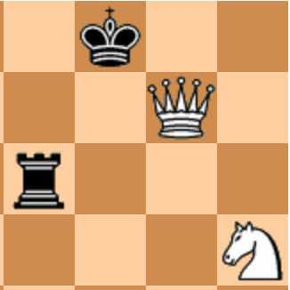

## 対象解除法が正しいか検証してみよう 
今回も引き続き、対象解除法が正しいかどうかを検証するためプログラムを改造したいと思います。
前回は出力結果を目視で検証しないとだめでしたが今回はプログラム内で検証できるようにしたいと思います。 

プログラムソースは以下のURLにあります。    
https://github.com/suzukiiichiro/N-Queens/blob/master/03Python/py04_nqueen.py    

## プログラム内で検証する方法 
前回の試みでABORDを使えばプログラムで全ての解のクイーンの配置の出力はできそうです。                

stotal が2,4,8のものについて出力結果を回転させてクイーンの配置を作ることができれば、両者を比較して解の数、クイーンの配置が全て同じであれば対象解除法が正しいと言えそうです。                  

プログラムでABOARDを回転させるにはどうすれば良いでしょう。 
symmetryopsはメソッド内でABOARDを回転させてクイーンの配置をチェックしています。 
vmirrorメソッドが左右反転、rotateメソッドが90度回転です。
これらのメソッドを利用して出力結果を回転させるプログラムを作ってみましょう。

## 垂直方向に左右反転(vmirror)
垂直方向に左右反転させてい場合どうすればよいでしょうか。
以下の2つの図を見比べてみてください。
上が元の駒の配置で、下が垂直方法に左右反転させたものです。

 

 

上の図の駒のある場所は
[0]=2
[1]=1
[2]=3
[3]=0
下の左右反転した図の駒のある場所は
[0]=1
[1]=2
[2]=0
[3]=3

図でみてわかるように垂直方向の左右反転のロジックは簡単で
・同じ行で駒を移動します
・右端だったら左端、右から2番目だったら左から2番目に駒を移動します

これをプログラムにしたのがvmirrorです。

vmirror メソッドを見てみましょう。
垂直方向に左右反転するメソッドです。
ABOARD配列の中身を1行ずつ見て
(size-1)-クイーンの場所
にクイーンをおきかえています

```
#メソッド
def vmirror(chk, neg):
  """ vMirror() """
  for i in range(neg):
    chk[i] = (neg-1)-chk[i]
```

```
#呼び出し元
  for i in range(size):
    AT[i] = ABOARD[i]
  # 垂直反転
  vmirror(AT, size)
```

## 


```
#メソッド
# 回転
def rotate(chk, scr, _n, neg):
  """ rotate() """
  incr = 0
  k = 0 if neg else _n-1
  incr = 1 if neg else -1
  for i in range(_n):
    scr[i] = chk[k]
    k += incr
  k = _n-1 if neg else 0
  for i in range(_n):
    chk[scr[i]] = k
    k -= incr
#
```

```
#呼び出し元
  for i in range(size):
    AT[i] = ABOARD[i]
  # 時計回りに90度回転
  rotate(AT, AS, size, 0)
```

rotateメソッドは反時計回りに移動する
1番下の行が右端の列にいどうする
