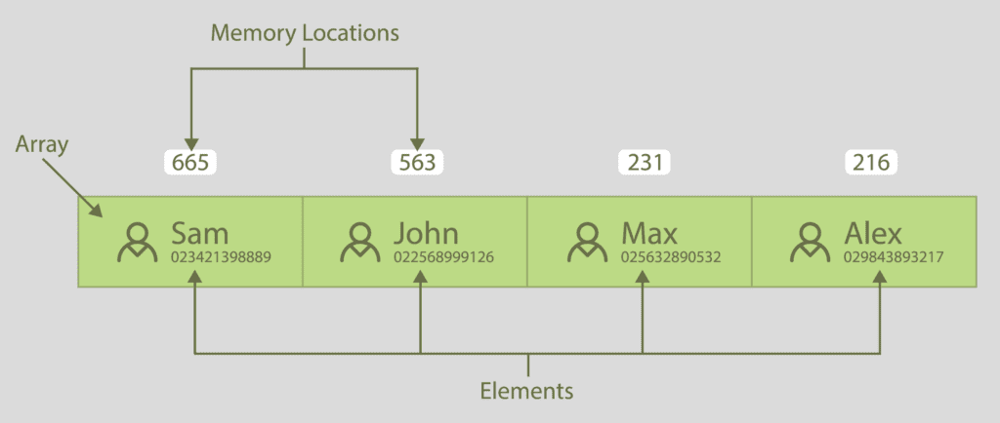

Bashスクリプト（シェルスクリプト） は５０年以上も前からUNIXプログラミングのエッセンスとして君臨し、現在もLinuxのコマンドの殆どを構築しています。

こうしたShellと言われるものはいくつか存在します。

Bourne Shell
Bourne Again Shell
C Shell
Korn Shell
TC Shell

Bourne Again Shell ( BASH ) は、多くのLinuxディストリビューションのデフォルトシェルです。

強力なコマンド編集機能
無制限のイベント履歴
エイリアスの導入
無制限のサイズの配列

Bashは、強力な編集機能や変更機能など、多くの高度な機能があり、信じられないほどユーザー フレンドリーになっています。


＜＜ばっさり省略＞＞


こうしたBashスクリプトでアルゴリズムを習得するシリーズを始めます。
まずは、Bashスクリプトの初歩、そしてデータ構造について、その後、ソートアルゴリズムやツリー、グラフなどへ進みます。

このページではBashスクリプトによる配列について、重点的に習得します。

以下は、目次となります。


## Bashスクリプティング

Bashスクリプトを作成するには、テキストエディターを開き、冒頭１行目に「/usr/bin/bash」のPATHを 「#!」で参照します。この１行目を she-Bang（シェバン）といいます。

シェバンは１行目になければなりません。
２行目は空行である必要があります。

３行目に「Hello, world!」を出力するスクリプトを記述します。

```bash
#!/usr/bin/bash

echo "Hello, world!" ;

```

テキストエディタを保存しファイル名を「hello.sh」としてファイルを閉じます。
コンソール画面でhello.shを確認したら、bashコマンドで、先ほど作成したファイルを実行します。

```
local: $ bash hello.sh
Hello, world!
local: $
```

Bash スクリプトで変数を割り当てるのはとてもかんたんです。データ型は不要です。任意の文字、単語、数字は自動で判断され処理します。

コメント行は 「#」を行頭に挿入します。「#」以降の文字列はコメント業として扱われます。
複数行のコメントは「 :'」で開始し、「'」で終わります。


```bash
#!/usr/bin/bash

# 変数への代入
:'
変数名 = [値]
'

var="Hello, world!";
echo "$var";
```

実行結果は以下のとおりです。
```
local: $ bash hello.sh
Hello, world!
local: $
```

一つの変数は、一つの値を保持することができます。
同じデータ型の複数の値を保持する場合は、配列を使用します。
配列は、インデックス番号で識別される要素のコレクションです。
データ構造の実装に関しては、配列が不可欠です。


## 配列とは

一つの変数は、一つの値を保持することができます。
同じデータ型の複数の値を保持する場合は、配列を使用します。
配列は、インデックス番号で識別される要素のコレクションです。
データ構造の実装に関しては、配列が不可欠です。

実際の例で配列を理解します。
以下の電話連絡帳は、連絡先がその配列(Array)の要素(Elements)である配列です。連絡先番号の追加や削除など、配列の要素を操作することができます。



複数の変数を格納できる変数を「配列」と呼びます。
配列に多数の変数を割り当てる場合、特に制限はありません。
配列要素は、通常ゼロから始まるインデックス番号によって参照されます。
配列は主にデータ構造の実装に使用されます。

以下の画像は、１０個の要素があり、配列の長さは１０となります。
最初の要素番号は０で、最後の要素番号は９となります。


{}
ヒント
: 複数の変数を一つずつ定義する代わりに、配列を使用すると、一度に定義できます。これはプログラミングで変数を割り当てる効率的な方法です。
{}


## 配列の応用

配列は非常に強力なユーティリティであり、多くの科学計算で使用できます。どのプログラミング言語の配列も、他の構造体よりもはるかに機能的です。配列のいくつかの注目すべき実装を以下に示します。

- 配列は、同じ名前の複数の変数を管理するために使用されます。
- 配列はベクトルで使用できます。ベクトルは通常、機械学習で広く使用される 1 次元配列です。
- 配列はスタックの実装にも使用され、スタックは実際の物理オブジェクトの山のように動作します。
- 配列は、キュー、デキュー、およびハッシュ テーブルにも実装されます。
- 要素の長方形配列である行列も、配列を使用して実装されます。
- 多くのプログラムのグラフは、配列の実装でもあるリストを使用して描画されます。
- CPU スケジューリング アルゴリズムや並べ替えアルゴリズムなどの多くのアルゴリズムは、配列を使用して実装されます。
- 配列は、プログラム内の動的メモリ割り当てでも使用されます。
- 配列は音声処理でも使用されます。
- ノイズ除去フィルターも配列を使用しています。

上記の配列の実装は、配列データ型の可能性を明確に示しています。


## Bashにおける配列の構文

Bashはインデックス付き配列（１次元配列）と、連想配列の療法をサポートしています。以下は、Bashで配列を割り当てる典型的な構文です。

```bash
#name_of_array[添え字]=値
 name_of_array[subscript]=value;
```

配列は要素の集まりであるため、配列内の要素番号は添え字（そえじ）と呼ばれます。添え字は、配列内の要素の位置を示します。
例えば、配列内の５番目の要素に値を代入または変更するには、以下のようにします。

```bash
name_of_array[5]=value;

```

declare キーワードで配列を宣言するとより正確なソースコードを書くことができます。

```bash
declare -a name_of_array;

```

複数の値を代入する場合は以下の構文となります。

```bash
declare -a name_of_array;
name_of_array=(value1 value2 …);
```


## Bashでの配列の割り当て
Bash スクリプトの配列は、さまざまな方法で割り当てることができます。Bash スクリプトで配列を割り当てる最も簡単な方法は、以下に示すように、丸括弧内にスペースを含む一連の値を変数に割り当てることです。
「@」は配列内のすべての要素を指定する場合に使います。

```bash:number.sh
#!/usr/bin/bash

declare -a my_array=(1 2 3 4);
echo ${my_array[@]};
```

```
bash-5.1$ bash number.sh
1 2 3 4 5
bash-5.1$ 
```

Bash 配列には、さまざまなタイプの要素を含めることができます。文字列要素で配列を割り当てるには以下のとおりです。

```bash:month.sh
#!/usr/bin/bash

declare -a my_array=(jan feb mar apr);
echo ${my_array[@]};
```

```
bash-5.1$ bash month.sh
jan feb mar apr
bash-5.1$ 
```

配列に、要素を割り当てるには、角括弧 `[要素番号]で添字を指定して、値を割り当てます。

```bash:month2.sh
declare -a my_array=([0]="jan" [1]="feb" [2]="mar" [3]="apr");
echo ${my_array[@]};
```

```
bash-5.1$ bash month2.sh
jan feb mar apr
bash-5.1$ 
```

一行ずつ書くと以下の通りとなります。

```bash
my_array[0]="jan";
my_array[1]="feb";
```

配列は、「declare」 キーワードで宣言することもできます。オプション 「-a」 と 「-A」 は、それぞれインデックス付き配列と連想配列を宣言するために使用されます。


一般的な配列
```bash
declare -a my_array;
my_array[0]="jan";
my_array[1]="feb";
```

連想配列
```bash
declare -A my_array;
my_array[first]="jan";
my_array[second]="feb";
```

連想配列は以下のように入力することもできます。
```bash
my_array=([first]="jan" [second]="feb" [third]="mar" [fourth]="apr");
```


以下のスクリプトは、１から６までの数値を配列に代入します。
```bash:seq.sh
declare -a my_array=$(seq 1 6);
echo ${my_array[@]};
```

実行結果は以下のとおりです。
```
bash-5.1$ bash seq.sh
1 2 3 4 5 6
bash-5.1$ 
```


## ループによる配列の代入

配列は、ループを介して割り当てることもできます。
以下は、month_arrayの内容をmy_arrayへコピーして出力しています。

```bash:month_array.sh
#!/usr/bin/bash

declare -a month_array=("jan feb mar apr");
declare -i number=0; # 変数は数値型
declare -a my_array; # 変数は配列型

while read number;do
  my_array[$number]=${month_array[$number]};
  let number++;
done< <( seq 0 4)

echo ${my_array[@]};
```


## 文字列からの配列の代入

前の項のサンプルをもう少しかんたんに配列に割り当てることができます。

前の項のサンプル
```bash:month_array.sh
#!/usr/bin/bash

declare -a month_array=("jan feb mar apr");
declare -i number=0; # 変数は数値型
declare -a my_array; # 変数は配列型

while read number;do
  my_array[$number]=${month_array[$number]};
  let number++;
done< <( seq 0 4)

echo ${my_array[@]};
```

修正したスクリプト。while read がまるごと不要となっていますね。

```bash:month_array2.sh
#!/usr/bin/bash

declare -a month_array=("jan feb mar apr");
# コメントアウト
# declare -i number=0;
declare -a my_array=(${month_array// / });

: '
コメントアウト
while read number;do
  my_array[$number]=${month_array[$number]};
  let number++;
done< <( seq 0 4)
'
echo ${my_array[@]};

```


「- ハイフン」で区切りたい場合は以下のとおりです。

```bash
declare -a my_array=(${month_array//-/ });
```


## Bashの6種類の配列

配列を使用するには、多くの方法とアプローチがあります。Bash には、次の 2 種類のプライマリ配列があります。

- インデックス付き配列
- 連想配列


## インデックス付き配列

インデックス付き配列は、0 から始まるインデックス番号で参照される要素を格納する配列の基本的な形式です。Bash スクリプトでのインデックス付き配列の例を以下に示します。

```bash
my_array=(a b c d)
```

前述の通り、配列はdeclareキーワードを使って宣言すると、間違いな少なくなります。

以下の例では、  「array」 は変数です 。「a、b、c、d」 は配列の要素です。配列の長さは 4 で、  「a」 要素のインデックス番号は 0 番目のインデックスにあり、  「d」 は 3 番目のインデックスにあります。

```bash
declare -a my_array;
my_array[0]="First Item";
my_array[1]="Second Item";
```

<!-- 
## 連想配列
## Bashでの配列へのアクセス
## 配列のすべての要素の表示
## 配列の特定の要素の表示
## 配列の初期化されたインデックスへのアクセス
## Bashでの配列の変更
## 要素の更新
## 要素の追加
## 要素の挿入
## 要素の削除
## 配列のマージ
## 配列要素のギャップの削除
## Bashでループを使用して配列を反復処理する
## Bashの配列の長さ
## Bashでの連想配列へのアクセス
## Bash配列の例
## 配列を介したファイルの読み取り
## Bashでのバブルソート
## Bashの多次元配列
## Bashで詩をフォーマットする
## 結論
-->

## 「ざっくり」シリーズのご紹介
【アルゴリズム 配列編】ざっくりわかるシェルスクリプト６
https://suzukiiichiro.github.io/posts/2022-09-27-01-array-suzuki/
【grep/sed/awkも】ざっくりわかるシェルスクリプト５
https://suzukiiichiro.github.io/posts/2022-02-02-01-suzuki/
【grep特集】ざっくりわかるシェルスクリプト４
https://suzukiiichiro.github.io/posts/2022-01-24-01-suzuki/
【はじめから】ざっくりわかるシェルスクリプト３
https://suzukiiichiro.github.io/posts/2022-01-13-01-suzuki/
【はじめから】ざっくりわかるシェルスクリプト２
https://suzukiiichiro.github.io/posts/2022-01-12-01-suzuki/
【はじめから】ざっくりわかるシェルスクリプト１
https://suzukiiichiro.github.io/posts/2022-01-07-01-suzuki/

【TIPS】ざっくりわかるシェルスクリプト
https://suzukiiichiro.github.io/posts/2022-09-26-01-tips-suzuki/


<!--
{}
ヒント
{}

{}
注意
{}
-->


## 書籍の紹介

{{% amazon

title="詳解 シェルスクリプト 大型本  2006/1/16"

url="https://www.amazon.co.jp/gp/proteect/4873112672/ref=as_li_tl?ie=UTF8&camp=247&creative=1211&creativeASIN=4873112672&linkCode=as2&tag=nlpqueens-22&linkId=ef087fd92d3628bb94e1eb10cb202d43"

summary=`Unixのプログラムは「ツール」と呼ばれます。
Unixは、処理を実現するために複数の道具(ツール)を組み合わせる「ソフトウェアツール」という思想の下に設計されているためです。
そしてこれらツールを「組み合わせる」ということこそがUnixの真髄です。
また、シェルスクリプトの作成には言語自体だけでなくそれぞれのツールに対する理解も求められます。
つまり、あるツールが何のためのものであり、それを単体あるいは他のプログラムと組み合わせて利用するにはどのようにすればよいかということを理解しなければなりません。
本書は、Unixシステムへの理解を深めながら、シェルスクリプトの基礎から応用までを幅広く解説します。
標準化されたシェルを通じてUnix(LinuxやFreeBSD、Mac OS XなどあらゆるUnix互換OSを含む)の各種ツールを組み合わせ、
目的の処理を実現するための方法を詳しく学ぶことができます。
`
imageUrl="https://m.media-amazon.com/images/I/51EAPCH56ML._SL250_.jpg"
%}}

{}


{{% amazon

title="[改訂第3版]シェルスクリプト基本リファレンス ──#!/bin/shで、ここまでできる (WEB+DB PRESS plus) 単行本（ソフトカバー）  2017/1/20"

url="https://www.amazon.co.jp/gp/proteect/4774186945/ref=as_li_tl?ie=UTF8&camp=247&creative=1211&creativeASIN=4774186945&linkCode=as2&tag=nlpqueens-22&linkId=8ef3ff961c569212e910cf3d6e37dcb6"

summary=`定番の1冊『シェルスクリプト基本リファレンス』の改訂第3版。
シェルスクリプトの知識は、プログラマにとって長く役立つ知識です。
本書では、複数のプラットフォームに対応できる移植性の高いシェルスクリプト作成に主眼を置き、
基本から丁寧に解説。
第3版では最新のLinux/FreeBSD/Solarisに加え、組み込み分野等で注目度の高いBusyBoxもサポート。
合わせて、全収録スクリプトに関してWindowsおよびmacOS環境でのbashの動作確認も行い、さらなる移植性の高さを追求。
ますますパワーアップした改訂版をお届けします。`
imageUrl="https://m.media-amazon.com/images/I/41i956UyusL._SL250_.jpg"
%}}

{{% amazon

title="新しいシェルプログラミングの教科書 単行本"

url="https://www.amazon.co.jp/gp/proteect/4797393106/ref=as_li_tl?ie=UTF8&camp=247&creative=1211&creativeASIN=4797393106&linkCode=as2&tag=nlpqueens-22&linkId=f514a6378c1c10e59ab16275745c2439"

summary=`エキスパートを目指せ!!

システム管理やソフトウェア開発など、
実際の業務では欠かせないシェルスクリプトの知識を徹底解説

ほとんどのディストリビューションでデフォルトとなっているbashに特化することで、
類書と差別化を図るとともに、より実践的なプログラミングを紹介します。
またプログラミング手法の理解に欠かせないLinuxの仕組みについてもできるかぎり解説しました。
イマドキのエンジニア必携の一冊。

▼目次
CHAPTER01 シェルってなんだろう
CHAPTER02 シェルスクリプトとは何か
CHAPTER03 シェルスクリプトの基本
CHAPTER04 変数
CHAPTER05 クォーティング
CHAPTER06 制御構造
CHAPTER07 リダイレクトとパイプ
CHAPTER08 関数
CHAPTER09 組み込みコマンド
CHAPTER10 正規表現と文字列
CHAPTER11 シェルスクリプトの実行方法
CHAPTER12 シェルスクリプトのサンプルで学ぼう
CHAPTER13 シェルスクリプトの実用例
CHAPTER14 テストとデバッグ
CHAPTER15 読みやすいシェルスクリプト
`
imageUrl="https://m.media-amazon.com/images/I/41d1D6rgDiL._SL250_.jpg"
%}}


