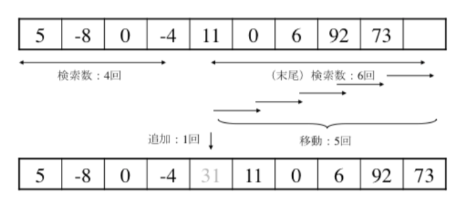
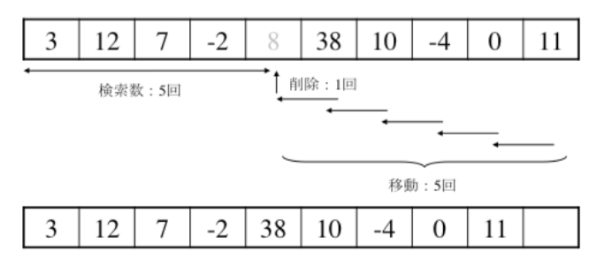

## Bash/シェルスクリプトで学ぶビッグオー

ビッグオーとは？

オーダー記法です。
オーダー記法とは、「計算量の割合」です。


例）Aさんの年齢はｘ歳、１３０歳以上生きる人間は存在しない。

ｘ＜＝１３０となりますので、ビッグオー記法では、
`O(130)` となります。


例）
相手に「0 以上 32 未満の整数値」をなにか 1 つ思い浮かべてもらい、それを当てたいです。
相手に何回か「Yes / No で答えられる質問」をすることができます。できるだけ少ない回数で当てるにはどうしたらよいでしょうか？

０ですか？
１ですか？
２ですか？
３ですか？
：
：

この方法であれば最悪３２回の探索が必要となります。

O(N)でこれは線形探索とアルゴリズムです。
　Nは３２を表します。

３２の半分の１６を基準に、

１６以上ですか？

はい なら: 0 以上 16 未満だとわかる
いいえ なら: 16 以上 32 未満だとわかる

はい　であれば、
８以上ですか？

と、半分に区切り質問していくと５会の質問で数を当てることができます。

O(log(N)) となり、これは二分探索法（バイナリサーチ）となります。


## O(1)
配列の添字を使った探索がこれに該当する
要素が多くなっても決まった処理しか行われない
命令数がデータ数に比例することを意味する。
データ量と関係なく、処理時間が一定。
オーダーで最も速い。

```bash
#!/usr/bin/bash

#配列
declare -a array=(1 2 3 4 5); 
#
##
# 配列の添字アクセス
# <>exec()
function exec(){
  local key=$1;
  echo "array[$key]: " $(( array[key] ));
}
##
#
exec 3;
```

## O(N)
線形探索がこれに該当する。
偶数出力はこのパターン。
最悪ケースについて考えるパターン。
データ量に応じて処理時間が比例する
for文で配列の中身をくまなく調べる場合がこれ

```bash
#!/usr/bin/bash

declare -a array=(1,2,3,4,5); #配列
declare -i nElems=5;          #要素の数
##
# <>exec() 
# forの一重ループ
function exec(){
  local key=$1;
  for((i=0;i<nElems;i++)){
    if(( array[i]==key ));then
      echo "key : $key";
    fi
  }
}
##
#
# 実行
exec 3;
```

## O(N^2)
バブルソートがこれに該当する
かけ算の九九がこのパターン。
二重ループに代表される縦と横、iとj、XとYといった総当り探索がこれ。
二重ループ構造なので「指数的爆発」が起きて非常に遅くなる。
データが多いとクラッシュする可能性もあるので注意。
O(N) に比べてかなり遅い。

```bash
#!/usr/bin/bash

declare -a array=(1 2 3 4 5); #配列
declare -i nElems=5;
##
# <>exec()
# forの二重ループ 
function exec(){
  for((i=0;i<nElems;i++)){
    for((j=0;j<nElems;j++)){
      echo $(( array[i] + array[j] ));
    }
  }
}

exec ;
```

## O(N^3)
行列乗算の以下のパターン
とてつもなく遅いです。

```bash
for((i=0;i<n;i++)){
	for((j=0;j<n;j++)){
		for((k=0;k<n;k++)){ 
			array[k]=$(( array[i] * array[j] ));
```
## O(log(N))
二分探索法（バイナリサーチ）がこれに該当する。
処理するたびにターゲットが絞られて早くなるオーダー
O(N) に比べてかなり早い
データ量に対して、計算量を常に半分にしていくのですごく速い。
プログラムで書かれているのは「二分探索」というアルゴリズム。
データ量が 4000 あっても 12 回の処理で完了する

```bash
#!/usr/bin/bash

#########
# バイナリサーチによる
# ユーザーへのインタフェース
#########
#
# 画面をクリアする
clear
# 要素の数は１００
declare -i nElems=100;
echo "要素の数は $nElems です。"
#
for((i=0;i<nElems;i++)){
    arr[$i]=$i;
    echo "${arr[$i]}";
}
#
echo -n "探したい数字を入力してください:"
read item
##

declare -i lb=1;
declare -i ub=$nElems;

while [ $lb -le $ub ];do
    x=`expr $ub + $lb`
    mid=`expr $x / 2`
    if [ $item -lt ${arr[$mid]} ];then
        ub=`expr $mid - 1`
    elif [ $item -gt ${arr[$mid]} ];then
        lb=`expr $mid + 1`
    elif [ $item -eq ${arr[$mid]} ];then
        echo $item found at position $mid 
        break
    fi
done
if [ $lb -gt $ub ];then
 echo not found;
fi
```

## O(N log(N)) 
クイックソート、マージソートがこれに該当する。

## ビッグオーとアルゴリズム「ざっくり比較」

|表記    |意味    |例    |速い順|
|:---    |:---:   |:---  |:---:|
|O(1)    |定数    |配列を添字アクセスする場合（ex. a[0] = 1;）    |1|
|O(log(n))    |対数    |二分探索    |2|
|O(n)    |一時    |線形探索、グラフ探索    |3|
|O(n log n)    |nlog n    |クイックソート、マージソート    |4|
|O(N^2)    |二次    |バブルソート、挿入ソート    |5|

ビッグオー記法についてとても詳しく書かれている奇跡のページ
[計算量オーダーの求め方を総整理！ 〜 どこから log が出て来るか 〜](https://qiita.com/drken/items/872ebc3a2b5caaa4a0d0)


## 配列の基本操作で学ぶ「追加」

例題１
以下の配列の追加に必要な操作（回）数を求めると


次のように行われ、検索数５回、追加１回、合計は６回です。


例題２
以下の配列の追加に必要な操作（回）数を求めると


次のように行われるため、検索数１回、追加で１回の合計２回となります。


例題３
以下の配列の追加に必要な操作（回）数を求めると


次のように行われる。 検索数は１０回、追加で１回。


例題４
以下の配列の４の後ろに３１を追加したい。
この追加（挿入）に必要な操作（回）数を求めると、


次のように行われる。
まず、−４を検索します（場所を特定して記憶します）。
次に配列の末尾に空いているセル（場所）があるか否かを調べます。
あると、−４のセル以降のセルの後方への移動が可能となります（空きセルがないと、追加（挿入）は不可能となります）。

−４を検索するために４回、その場所から、末尾に空いているセルがあるか否かを調べるために６回、これで検索数は１０回となります。
その後、空白セルに一つずつセルを移動します。この作業は目印（−４の次のセル）まで行われます。この移動回数が５回となります。
そうすると、セルに空きが生まれたので追加で１回。
操作回数の合計は１６回となります。



## 配列の基本操作で学ぶ「削除」

例題５
以下の配列の１１の要素を削除したい。この削除に必要な操作（回）数を求めると、


次のように行われる。
該当のデータは最後の要素に格納されているため、配列の先頭から１０回の検索が必要です。データが見つかったため、削除自体は最後に１回行われます。つまり合計操作回数は１１回となります。
最後のデータを削除すると、作業は検索と削除しか含めませんが、その他の一の削除になると、移動の作業も必要となります。


例題６
以下の配列のセル８の内容を削除したい。この削除に必要な操作回数を求めると、


次のように行われる。
該当のデータの削除後、空白のセルが生じます。配列にはこれは許されないため、その位置から以降の内容のあるセルの移動が必要となります。
まず８を検索し、５回の検索で見つかりました。
その後、８を削除し操作が１回。
８の場所が空いたため、その位置以降の要素の内容を移動します。移動対象は５つなので、移動操作は５回行われます。
つまり合計操作回数は１１回となります。



## 配列の基本操作で学ぶ「存在確認」

例題７
以下の配列に７のデータがあるかを確認したい。


次のように行われる。
配列がからっぽなので検索は１回。このため操作回数は１回となります。


例題８
以下の配列に７のデータがあるかを確認したい。この検索に必要な操作（回）数を求めると、


次のように行われる。
該当データがないことと、最後のセルしか空いていないため、配列を最後まで検索する必要があります。結果は検索が１０回となります。


{}
ヒント
: ビッグ・オーという計算量の割合を表す記法があるということを覚えておいてください。
: バブルソートやバイナリサーチがどういった計算量なのかを考えるための基準は、配列へのアクセス方法、いわゆるループの構造です。
: アルゴリズムの全てにビッグオーがあります。
: この章で紹介した後半の「挿入」「削除」「移動」といった動きが計算量に影響するということを覚えておくと良いでしょう。
{}


## 「ざっくり」シリーズのご紹介
【アルゴリズム ビッグオー】ざっくりわかるシェルスクリプト９
https://suzukiiichiro.github.io/posts/2022-10-04-01-algorithm-bigO-suzuki/
【アルゴリズム ２次元配列編】ざっくりわかるシェルスクリプト８
https://suzukiiichiro.github.io/posts/2022-10-03-01-algorithm-eval-array-suzuki/
【アルゴリズム 配列準備編】ざっくりわかるシェルスクリプト７
https://suzukiiichiro.github.io/posts/2022-10-03-01-algorithm-array-suzuki/ 
【アルゴリズム 配列編】ざっくりわかるシェルスクリプト６
https://suzukiiichiro.github.io/posts/2022-09-27-01-array-suzuki/
【grep/sed/awkも】ざっくりわかるシェルスクリプト５
https://suzukiiichiro.github.io/posts/2022-02-02-01-suzuki/
【grep特集】ざっくりわかるシェルスクリプト４
https://suzukiiichiro.github.io/posts/2022-01-24-01-suzuki/
【はじめから】ざっくりわかるシェルスクリプト３
https://suzukiiichiro.github.io/posts/2022-01-13-01-suzuki/
【はじめから】ざっくりわかるシェルスクリプト２
https://suzukiiichiro.github.io/posts/2022-01-12-01-suzuki/
【はじめから】ざっくりわかるシェルスクリプト１
https://suzukiiichiro.github.io/posts/2022-01-07-01-suzuki/

【TIPS】ざっくりわかるシェルスクリプト
https://suzukiiichiro.github.io/posts/2022-09-26-01-tips-suzuki/


<!--
{}
ヒント
{}

{}
注意
{}
-->


## 書籍の紹介

{{% amazon

title="詳解 シェルスクリプト 大型本  2006/1/16"

url="https://www.amazon.co.jp/gp/proteect/4873112672/ref=as_li_tl?ie=UTF8&camp=247&creative=1211&creativeASIN=4873112672&linkCode=as2&tag=nlpqueens-22&linkId=ef087fd92d3628bb94e1eb10cb202d43"

summary=`Unixのプログラムは「ツール」と呼ばれます。
Unixは、処理を実現するために複数の道具(ツール)を組み合わせる「ソフトウェアツール」という思想の下に設計されているためです。
そしてこれらツールを「組み合わせる」ということこそがUnixの真髄です。
また、シェルスクリプトの作成には言語自体だけでなくそれぞれのツールに対する理解も求められます。
つまり、あるツールが何のためのものであり、それを単体あるいは他のプログラムと組み合わせて利用するにはどのようにすればよいかということを理解しなければなりません。
本書は、Unixシステムへの理解を深めながら、シェルスクリプトの基礎から応用までを幅広く解説します。
標準化されたシェルを通じてUnix(LinuxやFreeBSD、Mac OS XなどあらゆるUnix互換OSを含む)の各種ツールを組み合わせ、
目的の処理を実現するための方法を詳しく学ぶことができます。
`
imageUrl="https://m.media-amazon.com/images/I/51EAPCH56ML._SL250_.jpg"
%}}

{}


{{% amazon

title="[改訂第3版]シェルスクリプト基本リファレンス ──#!/bin/shで、ここまでできる (WEB+DB PRESS plus) 単行本（ソフトカバー）  2017/1/20"

url="https://www.amazon.co.jp/gp/proteect/4774186945/ref=as_li_tl?ie=UTF8&camp=247&creative=1211&creativeASIN=4774186945&linkCode=as2&tag=nlpqueens-22&linkId=8ef3ff961c569212e910cf3d6e37dcb6"

summary=`定番の1冊『シェルスクリプト基本リファレンス』の改訂第3版。
シェルスクリプトの知識は、プログラマにとって長く役立つ知識です。
本書では、複数のプラットフォームに対応できる移植性の高いシェルスクリプト作成に主眼を置き、
基本から丁寧に解説。
第3版では最新のLinux/FreeBSD/Solarisに加え、組み込み分野等で注目度の高いBusyBoxもサポート。
合わせて、全収録スクリプトに関してWindowsおよびmacOS環境でのbashの動作確認も行い、さらなる移植性の高さを追求。
ますますパワーアップした改訂版をお届けします。`
imageUrl="https://m.media-amazon.com/images/I/41i956UyusL._SL250_.jpg"
%}}

{{% amazon

title="新しいシェルプログラミングの教科書 単行本"

url="https://www.amazon.co.jp/gp/proteect/4797393106/ref=as_li_tl?ie=UTF8&camp=247&creative=1211&creativeASIN=4797393106&linkCode=as2&tag=nlpqueens-22&linkId=f514a6378c1c10e59ab16275745c2439"

summary=`エキスパートを目指せ!!

システム管理やソフトウェア開発など、
実際の業務では欠かせないシェルスクリプトの知識を徹底解説

ほとんどのディストリビューションでデフォルトとなっているbashに特化することで、
類書と差別化を図るとともに、より実践的なプログラミングを紹介します。
またプログラミング手法の理解に欠かせないLinuxの仕組みについてもできるかぎり解説しました。
イマドキのエンジニア必携の一冊。

▼目次
CHAPTER01 シェルってなんだろう
CHAPTER02 シェルスクリプトとは何か
CHAPTER03 シェルスクリプトの基本
CHAPTER04 変数
CHAPTER05 クォーティング
CHAPTER06 制御構造
CHAPTER07 リダイレクトとパイプ
CHAPTER08 関数
CHAPTER09 組み込みコマンド
CHAPTER10 正規表現と文字列
CHAPTER11 シェルスクリプトの実行方法
CHAPTER12 シェルスクリプトのサンプルで学ぼう
CHAPTER13 シェルスクリプトの実用例
CHAPTER14 テストとデバッグ
CHAPTER15 読みやすいシェルスクリプト
`
imageUrl="https://m.media-amazon.com/images/I/41d1D6rgDiL._SL250_.jpg"
%}}


