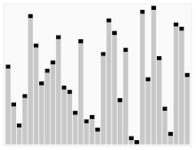
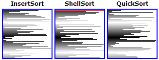
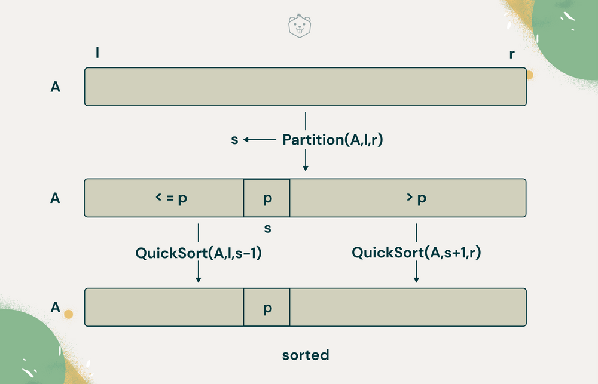
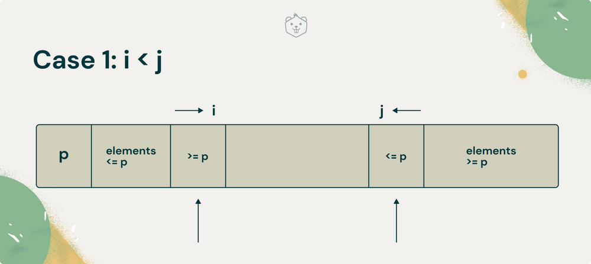
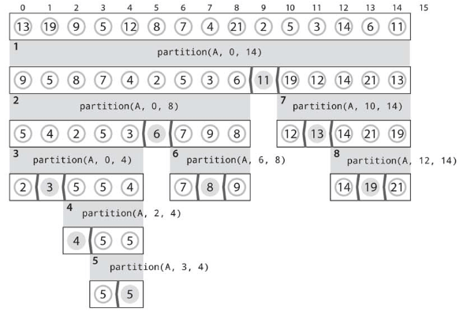
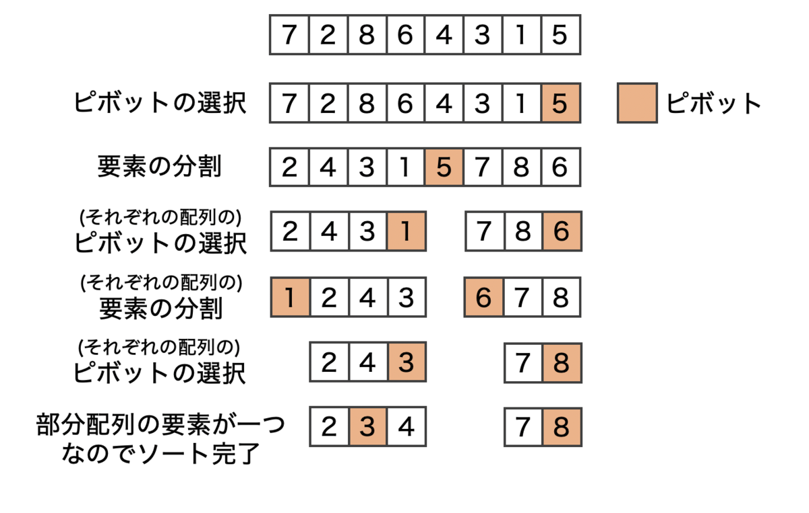
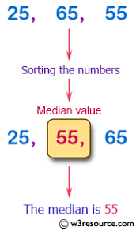
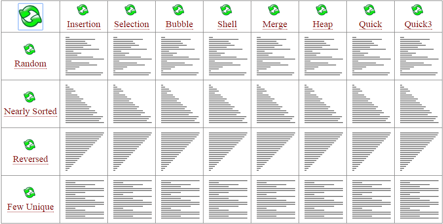

## クイックソート
クイックソートは、誰もが人気ナンバーワンと認めるソートアルゴリズムです。



理由として、クイックソートは多くの場合に最も高速です。
O(N＊log(N))



クイックソートは、１９６２年にC.A.R Hoareが発明しました。
ここまで習熟したいくつかのソートの知識は、クイックソートを理解するためのステップだったと言っても過言ではありません。


## クイックソート 習熟のステップ

１.クイックソートの基本型


このページでは、クイックソートの説明をします。
実装に関して、いくつかの工夫を盛り込みます。
クイックソートの基本形に加わる工夫は以下の２つです。

２.Median of Three 分割値（pivot）の選び方と実装
３.挿入ソート うんと小さな部分配列に適切なアルゴリズム

このページでは、クイックソートの「基本形」「メジアン」「挿入ソート導入版」の３つのステップでクイックソートを学びます。
ではさっそく、「クイックソート基本形」を見ていきましょう。


## クイックソート基本型
クイックソートの基本形を説明します。
クイックソートのアルゴリズムは、pivot(分割値）を区切りとして、配列を２つの部分配列に分割します。
また、その部分配列に対して自分自身を呼び出してクイックソートする、という再帰的な動作を繰り返します。


### クイックソート基本型のアルゴリズム
プログラムソースでは、クイックソート基本型の関数を`quickSort1()`としました。
メジアン対応（以降のセクションで説明します）を`quickSort2()`、挿入ソート導入版(以降のセクションで説明します）を`quickSort3()`という関数で呼び出します。
プログラムソースでは、３つのクイックソートは、一枚のbash/シェルスクリプトに同梱されています。
見比べたり、速度などを比較したりすると良いでしょう。


### 基本形：quickSort1()メソッド
まずは、`quickSort1()` クイックソートの基本形の関数を見てみましょう。クイックソート基本型のメソッドはかなり単純です。

この章で使っているプログラムソースは以下にあります。
[05_3QuickSort.sh クイックソート](https://github.com/suzukiiichiro/Algorithms-And-Data-Structures/tree/master/Bash/)


クイックソート基本形のおおまかなロジックは、３つの基本的なステップがあります。

１．配列ないし部分配列を左（小さなキー）と、右（大きなキー）のグループに分離する。
２．左側に関して自分自身を呼び出してソートする。
３．右側に関して自分自身を呼び出してソートする。


では、３つを順番に説明します。
１．配列ないし部分配列を左（小さなキー）と、右（大きなキー）のグループに分離する。


２．左側に関して自分自身を呼び出してソートする。


３．右側に関して自分自身を呼び出してソートする。


分割後１，２，３のステップを行ったあとは、左側の部分配列の項目はすべて、右側の項目よりも小さくなっています。

次に、その左側の部分配列と右側の部分配列をソートしたら、配列全体がソートされます。
でも、それらの部分配列をどうやってソートするか？

それは、クイックソートが、自分をその部分配列に対して呼び出すことによって、ソートを行います。

上記`QuickSort1()`メソッドにわたす引数は、これからソートする配列（または部分配列）の左端の右端を指定します。

メソッドは最初に、その配列の成分が１つかどうかを調べます。
成分が１つなら、その配列はソート済みであるとみなされ、メソッドは直ちにリターンします。
これが再帰処理の基底条件です。

``` bash
##
# quickSort1()
# クイックソート基本形
function quickSort1(){
  local left="$1" ;
  local right="$2" ;
  local size=$((right-left)) ;
  # サイズが１なら
  if [ "$size" -le 0 ]; then 
    return; # ソート済み
  else # サイズが２以上
    #範囲を分割する 戻り値は $pertision 
    pivot="${array[$right]}";
    pertisionIt1 "$left" "$right" "$pivot";
    #左側をソート
    quickSort1 "$left" "$((pertision-1))"  ;
    #右側をソート
    quickSort1 "$((pertision+1))" "$right" ; 
  fi
}

```


### 基本形：partitionIt1()メソッド
配列のセルが２つ以上ある場合には、`partitionIt1()`メソッドを呼び出して、その配列を分割します。
このメソッドは、分割後の右（大きなキー）のグループの左端の成分を指すインデクスを、変数partitionに返します。
partitionのこの値は、２つのグループの境界を指しています。



`partitionIt1()`を呼び出して配列を分割したら、分割後の２つの部分配列（左側と右側）に対してそれぞれ、`quickSort1()`を再帰的に呼び出します。
ただし、配列のpartitionインデクスの位置にある項目は、すでに正しいソート位置にありますから、これら２つの再帰呼び出しの引数となる２つの配列には含めません。
そこで、再帰呼び出しの引数はそれぞれ、partition-1、およびpartition+1となっています。


``` bash
##
# pertionIt1()
# 基本形のクイックソートで言うところのソートは
# このメソッドで行う
# メジアン・挿入ソート導入版といった共通メソッドの 
# pertisionIt()とはちょっと内容が異なる
function pertisionIt1(){
  #最初の成分の右
  local leftPtr=$(($1-1))  ;
  #分割値の左
  local rightPtr="$right" ;
  # local pivot="$3" ;
  while :; do
    #より大きい項目を見つける
    while ((array[++leftPtr]<pivot)); do
      : 
    done
    #より小さい項目を見つける
    while ((rightPtr>0 &&  array[--rightPtr]>pivot)); do
      :
    done
    #ポインタが交差したら
    if [ "$leftPtr" -ge "$rightPtr" ]; then
      #分割は終了
      break ;
    else
      #交差していないので成分を入れ替える
      local tmp="${array[leftPtr]}" ;
      array[leftPtr]="${array[rightPtr]}" ;
      array[rightPtr]="$tmp" ;
    fi
  done
  #分割値をリストア
  local tmp="${array[leftPtr]}" ;
  array[leftPtr]="${array[right]}" ;
  array[right]="$tmp" ;
  #分割値の位置を返す
  pertision="$leftPtr" ;
}
```


### 基本形：分割値（pivot）を選ぶ
`partitionIt1()`を呼び出す時、引数pivot（＝分割値）の値はどうやって決めるべきでしょうか？

- 分割地は、任意の値ではなく、これからソートするデータの中に実際にある値であるべきである。
- そして、分割地を実際のデータの中からランダムに選ぶ。たとえば、分割する部分配列の必ず右端の項目、と決めたらどうだろう？
- 分割後に、分割値として選んだ項目を、左と右の部分配列の境界に挿入したら、その項目は最終的なソート済みの位置に収まったことになる。


上の最後の点が、納得できないかもしれませんね。
でも、あるデータ項目のキーの値を、分割値として選んで分割をしたら、左の部分配列にはその分割値よりも小さな項目がすべて入り、右の部分配列には大きな項目がすべて入るのですから、ちょうど両者の境界にそ の分割値として選んだ項目を挿入すれば、その項目は、今後ソート過程がどのように進もうとも、それ以上右にも左にも動くはずがありません。 でしょう?


言い換えると、今後のソート過程は、それぞれ左右の部分配列の中だけで別々に進行するのです。
境界に挿入したその項目は、もはや動きませんし、動かす理由が今後とも生じません。

しかし、上記の図では、pivotを中心に配列を途中で切断して動かすという, 物理的にありえないことをしています。
実際には、左右の部分配列の境界に分割値の項目を挿入するという操作はどうやって行うのでしょうか?

右側の部分配列のすべての項目を１セルずつシフトして、分割値を入れるための空きを作る。という方法もあります。でもそれは効率が悪いし、しかも不必要な処理です。
なぜなら、左右の部分配列の中身は、まだソートされていないから、現時点の並び方を保存するために、前項目をお行儀よくシフトしても意味がないのです。

そこで、分割値を境界に挿入するためには、右側の部分配列の左端（＝境界位置）の項目と分割値を単純に入れ替えます。



分割値としては、「配列の右端」の項目を便宜的に選んでいますね。
ですから、その項目を「分割後の右側の部分配列の左端」の項目と入れ替えたとき、後者は配列の右端へ移動しますから、相変わらず右側部分配列の一員のままです。
すなわち、分割の結果は保存されます。
ですから、上のように入れ替えるだけでOKなのです。

分割値の項目を `partition` の位置へ入れ替えたら、その項目は最終的な位置に収まったことになります。 
その後の処理は、その項目の右側または左側で行われ、分割値自身は動きません。
今後それは、アクセスされることすらないのです!


9 はピボット (矢印で示される 8) よりも大きいため、何も起こりません。


11 はピボットよりも大きいので、先に進みます。


7 はピボットよりも小さいため、濃い灰色になります。
インデックス j を１つ進め、位置 i と j の要素を交換します。


14 も、ピボットよりも大きいです。


4 はピボットよりも小さいため、濃いグレーに色付けし、インデックス j を進めてスワップします。


9 はピボットよりも大きく、続けます…


6 の方が小さいので、j を進めてスワップします。


2も小さいので、また入れ替えて…


 …そして最後に、インデックス j を最後にもう一度進め、指定された位置でピボットを交換します。


{}
ヒント
: 逆順にソートされた１００本の棒をソートしたとします。
動きがかなり遅いことになります。それは分割によって大きな部分配列が大量に作られるからです。問題は分割値の決め方にあるのです。
{}


## Median of Three 分割値（pivot）の選び方 

この章で使っているプログラムソースは以下にあります。
[05_3QuickSort.sh クイックソート](https://github.com/suzukiiichiro/Algorithms-And-Data-Structures/tree/master/Bash/)

クイックソートの分割値の選び方は、これまでに色んな方法が提案されています。
その選び方は、簡単でしかも最大や最小の値には決してならない、という方法でなければ常に良い選択になるとは限りません。
では、すべての項目の値を調べて、そのメジアン（データ全体の中で、その値より大きな項目の一人、小さな項目の数がちょうど半々になるようなデータ中の実在する値）を取る、という方法はどうでしょう？

配列の最初の項目と、最後の項目、そして中央の項目、以上３つの項目のメジアンを分割値として選ぶ、という方法です。


３項目のメジアンを求めることは、全項目のメジアンを求めるよりも当然ながら速いし、それにまた、データがすでにソート済み、または逆順ソート状態だったときでも、最大や最小の項目は選ばれません。
この「３のメジアン法」を使って最悪に近い値が選ばれてしまう、という可能性はゼロではありませんが, それはまあ、滅多にないことです。
通常は、３のメジアンは分割値を選ぶ最良の方法と見なされています。



「３つのメジアン法」には、良い分割値を選ぶことに加えて、もうひとつの利点があります。
内側の２つ目のwhileループの、`rightPtr>left` というテストが省略できるので、アルゴリズムのスピードがやや上がります。
なぜ、そのテストを省略できるのでしょうか?

「3のメジアン法」では、分割値が決まるだけではなく、その3つの項目がついでにソートされてしまうから, whileループでのテストを省略できるというメリットがあります。


``` bash
##
# pertisionIt()
#
function pertisionIt(){
  #最初の成分の右
  local leftPtr=$1  ;
  #分割値の左
  local rightPtr=$(($2-1)) ;
  local pivot=$3
  while :; do
    #より大きい項目を見つける
    while (( "${array[++leftPtr]}" < "$pivot" )); do
      : 
    done
    #より小さい項目を見つける
    while (( "${array[--rightPtr]}" > "$pivot" )); do
      :
    done
    #ポインタが交差したら
    if [ "$leftPtr" -ge "$rightPtr" ]; then
      #分割は終了
      break ;
    else
      # leftPtr rightPtr
      #交差していないので成分を入れ替える
      local tmp="${array[leftPtr]}" ;
      array[leftPtr]="${array[rightPtr]}" ;
      array[rightPtr]="$tmp" ;
    fi
  done
  #leftPtr right-1
  #分割値をリストア
  local tmp="${array[leftPtr]}" ;
  array[leftPtr]="${array[right-1]}" ;
  array[right-1]="$tmp" ;
  #分割値の位置を返す
  pertision="$leftPtr" ;
}
```
左端、中央、右端の3つの項目がソートされ、そのメジアンが分割値として選ばれると、部分配列の左端の項目はすでに確実に分割値以下であり、右端の項目は確実に分割値以上です。

そうすると, leftPtrやrightPtr が指す配列インデクスは、テストを省いても、配列の両端を踏み越すことはなくなります (その項目で矢印は停止して, 項目の入れ替え をしようとしますが、そのときは同時に、相方の矢印と出会ってしまっているので、分割の完了を悟るのです)。
このようなleftとrightの値を、ポインタやインデクス変数が配列境界を踏み越えないようにするための歩哨 (sentinel (s)) と呼びます。

「３のメジアン法」のもうひとつの利点は、左、中央、右の計３項目がソートされると、分割の過程ではそれら３つの成分を調べなくてよいことです。

分割は、left + 1 および right - 1 から開始できます。
なぜなら, leftとrightにはすでに分割済みの項目が収まっているからです。

メジアンを分割値として選んだのだから、left は確かに分割値よ 小さな値ですし、したがって最終的に分割された左側グループの一員です。

同じく、right は分割値より大きな項目ですから、分割後の右側グループの一員です。

以上のように、「３のメジアン法」による分割は、 ソート済みデータの場合にO(N2) の実行性能になることを防ぐだけではなく、分割アルゴリズムの内側ループをスピードアップし、また、分割する項目の数をやや減らします。


``` bash
##
# medialOf3()
# 
function medianOf3(){
  local left=$1 ;
  local right=$2 ;
  local center="$(( (left+right) / 2 ))" ;
  if [ "${array[left]}" -gt "${array[center]}" ]; then
    # left / centerを正順化
    local tmp="${array[left]}" ;
    array[left]="${array[center]}" ;
    array[center]="$tmp" ;
  fi
  if [ "${array[left]}" -gt "${array[right]}" ]; then
    # left / rightを正順化
    local tmp="${array[left]}" ;
    array[left]="${array[right]}";
    array[right]="$tmp" ;
  fi
  if [ "${array[center]}" -gt "${array[right]}" ]; then
    # center rightを正順化
    local tmp="${array[center]}" ;
    array[center]="${array[right]}" ;
    array[right]="$tmp" ;
  fi
  # 分割値をrightに
  local tmp="${array[center]}" ;
  array[center]="${array[right-1]}" ;
  array[right-1]="$tmp" ;
  #メジアンの値を返す
  median="${array[right-1]}" ;
}

```


## 挿入ソート うんと小さな部分配列のソート


この章で使っているプログラムソースは以下にあります。
[05_3QuickSort.sh クイックソート](https://github.com/suzukiiichiro/Algorithms-And-Data-Structures/tree/master/Bash/)


小さな部分配列に対して挿入ソートを使うと、少なくとも例題実装 の中では最高速という結果になりました。
クイックソートの段階での比較や、コピーの回数は大きく減りますが、しかしその分、挿入ソートでの比較やコピーの回数が増えてしまいます。

ですから、小さな部分配列に対して挿入ソートを使うことは、それほど大きな改良ではありません。
しかしそれでも、クイックソートをぎりぎりまで高速化しなければならない場合には、 利用価値のある方法といえます。


クイックソートのもうひとつの改良アイデアは、分割によってできる部分配列がある程度大きい間はクイックソートをして、それ以降の小さな部分配列はそのまま放置します。
そうすると配列全体としては、「ほとんどソートされた」状態になります。
その配列全体に対して、今度は挿入ソートを適用します。
挿入ソートは、ほとんどソートされた状態の配列に対しては高速ですから、何人かの専門家はこの方法を推奨しています。


```bash:05_3QuickSort.sh
#!/bin/bash

# ########################################################
# <>quickSort
# クイックソート
# https://www.youtube.com/watch?v=aQiWF4E8flQ
#　平均計算時間が O(n Log n)
#　安定ソートではない
#　最大計算時間が O(n^2)
#
# データ数が 50 以下なら挿入ソート (Insertion Sort)
# データ数が 5 万以下ならマージソート (Merge Sort)
# データ数がそれより多いならクイックソート (Quick Sort)
#
# 1. 一般的なクイックソート
# 2. ３つのメジアンによる分割と、
#    小さな配列の場合はマニュアルソートを取り入れたクイックソート
# 3.
#
#
##############
# 共通ブロック
##############
##
# display()
# 表示
function display(){
  for((i=0;i<nElems;i++)){
    echo "$i" "${array["$i"]}";
  }
  echo "------" ;
}
##
# insert()
# 配列の作成
function insert(){
  array[$((nElems++))]=$1
}
##
# setArray()
# 配列をセット
function setArray(){
  nElems=0;
  for((i=0; i<"$1"; i++)){
    insert `echo "$RANDOM"` ;
  }
}
##
# pertisionIt()
#
function pertisionIt(){
  #最初の成分の右
  local leftPtr=$1  ;
  #分割値の左
  local rightPtr=$(($2-1)) ;
  local pivot=$3
  while :; do
    #より大きい項目を見つける
    while (( "${array[++leftPtr]}" < "$pivot" )); do
      : 
    done
    #より小さい項目を見つける
    while (( "${array[--rightPtr]}" > "$pivot" )); do
      :
    done
    #ポインタが交差したら
    if [ "$leftPtr" -ge "$rightPtr" ]; then
      #分割は終了
      break ;
    else
      # leftPtr rightPtr
      #交差していないので成分を入れ替える
      local tmp="${array[leftPtr]}" ;
      array[leftPtr]="${array[rightPtr]}" ;
      array[rightPtr]="$tmp" ;
    fi
  done
  #leftPtr right-1
  #分割値をリストア
  local tmp="${array[leftPtr]}" ;
  array[leftPtr]="${array[right-1]}" ;
  array[right-1]="$tmp" ;
  #分割値の位置を返す
  pertision="$leftPtr" ;
}
##
# medialOf3()
# 
function medianOf3(){
  local left=$1 ;
  local right=$2 ;
  local center="$(( (left+right) / 2 ))" ;
  if [ "${array[left]}" -gt "${array[center]}" ]; then
    # left / centerを正順化
    local tmp="${array[left]}" ;
    array[left]="${array[center]}" ;
    array[center]="$tmp" ;
  fi
  if [ "${array[left]}" -gt "${array[right]}" ]; then
    # left / rightを正順化
    local tmp="${array[left]}" ;
    array[left]="${array[right]}";
    array[right]="$tmp" ;
  fi
  if [ "${array[center]}" -gt "${array[right]}" ]; then
    # center rightを正順化
    local tmp="${array[center]}" ;
    array[center]="${array[right]}" ;
    array[right]="$tmp" ;
  fi
  # 分割値をrightに
  local tmp="${array[center]}" ;
  array[center]="${array[right-1]}" ;
  array[right-1]="$tmp" ;
  #メジアンの値を返す
  median="${array[right-1]}" ;
}
##
#
########################################
# 3. 【完成版】小さな分割の場合に挿入ソートを行うクイックソート
# クイックソートのような強力なアルゴリズムが、再帰呼び出しの行き着く果てに、わ
# ずか２項目か３項目の小さな配列にも適用されるのは、妙な感じがします。最後の段
# 階、いわゆる小さな分割の場合に挿入ソートを行うクイックソート完成版。 
# 分割によってできる部分配列がある程度大きい間はクイックソートをして、それ以降
# の小さな部分配列はそのまま放置します。そうすると、配列全体としては、ほとんど
# ソートされた状態になります。その配列全体に対して、今度は挿入ソートを適用しま
# す。挿入ソートはほとんどソートされた状態の配列に対しては高速です。と、何人か
# の専門家は言っていますが、実は挿入ソートは、大きな配列を１つソートするより、
# 小さなソートをたくさんするほうが向いているのです。
##
# insertionSort3()
# 挿入ソート
function insertionSort(){
  for((out=left+1; out<=right; out++ )){
    tmp="${array[out]}" ;
    in="$out" ;
    while(( in>left && array[in-1]>=tmp )); do
      array[in]="${array[in-1]}" ;
      ((--in));
    done
    array[in]="$tmp"
  }
}
##
# quickSort3()
# クイックソート挿入ソート導入型
function quickSort3(){
  local left="$1" ;
  local right="$2" ;
  local size=$((right-left+1)) ;
  #小さければ挿入ソート
  if [ "$size" -lt 10 ]; then
    insertionSort "$left" "$right" ;
  else
    medianOf3 "$left" "$right" ;
    #範囲を分割する 戻り値は $pertision 
    pertisionIt "$left" "$right" "$median";
    #左側をソート
    quickSort3 "$left" "$((pertision-1))"  ;
    #右側をソート
    quickSort3 "$((pertision+1))" "$right" ; 
  fi
}
##
# exec_QuickSort3()
# クイックソート挿入ソート導入型
function exec_QuickSort3(){
  setArray "$1" ;
  # display ;
  quickSort3 0 $((nElems-1));
  display ;
}
#
########################################
# 2. ３つのメジアンによる分割と
# 要素数が３よりも小さな配列の場合はマニュアルソートを取り入れたクイックソート
#
# クイックソートの分割値の選び方は、これまでにいろんな方法が提案されています。
# その選び方は簡単でしかも最大や最小の値には決してならないという方法でなければ
# なりません。ランダムに選ぶのは方法としては簡単ですが、すでに見たように必ずし
# も常によい選択になるとは限りません。では全ての項目の値を調べて、そのメジアン
# をとるというのはどうでしょう？この方法は分割値の決め方としては理想的でもしか
# し、ソートそのものよりも多くの時間を要してしまいますから実用的ではありません。
# そこで妥協案として考えられたのが、配列の最初の項目、最後の項目、そして中央の
# 項目の中央の値を分割値とする方法を、３つのメジアンと言います。
# さらに成分が３よりも少ない小さな配列をソートするmanualSort()を実装しています。
# このメソッドは、部分配列が１セル以下なら直ちにリターン、２セルなら必要な入れ
# 替えを行い、３セルならソートをします。３のメジアン法は、配列が４成分以上でな
# いと使えませんから、３成分以下の配列に対しては今回のrecQuickSort()では使えな
# いのです。
##
##
# manualSort()
# 
function manualSort(){
  local left="$1" ;
  local right="$2" ;
  local size=$((right-left+1)) ; 
  if [ "$size" -le 1 ]; then
    #ソート不要
    return ;
  fi
  if [ "$size" -eq 2 ]; then
    #２のソート leftとrightを入れ替える
    if [ "${array[left]}" -gt "${array[right]}" ]; then 
      local tmp="${array[left]}" ;
      array[left]="${array[right]}" ;
      array[right]="$tmp" ;
      return ;
    fi
  else
    #サイズが３
    #３のソート,left, center, (right-1) & right
    if [ "${array[left]}" -gt "${array[right-1]}" ]; then
      # left / center
      local tmp="${array[left]}" ;
      array[left]="${array[right-1]}" ;
      array[right-1]="$tmp" ;
    fi
    # left / right
    if [ "${array[left]}" -gt "${array[right]}" ]; then
      local tmp="${array[left]}" ;
      array[left]="${array[right]}" ;
      array[right]="$tmp" ;
    fi
    # center / right
    if [ "${array[right-1]}" -gt "${array[right]}" ]; then
      local tmp="${array[right-1]}" ;
      array[right-1]="${array[right]}" ;
      array[right]="$tmp" ;
    fi
  fi
}
##
# quickSort2()
# クイックソート改良版
function quickSort2(){
  local left="$1" ;
  local right="$2" ;
  local size=$((right-left+1)) ;
  if [ "$size" -le 3 ]; then
    #小さければマニュアルソート
    manualSort "$left" "$right" ;
  else
    medianOf3 "$left" "$right" ;
    #範囲を分割する 戻り値は $pertision 
    pertisionIt "$left" "$right" "$median";
    #左側をソート
    quickSort2 "$left" "$((pertision-1))"  ;
    #右側をソート
    quickSort2 "$((pertision+1))" "$right" ; 
  fi
}
##
# exec_QuickSort2()
# クイックソート改良型
function exec_QuickSort2(){
  setArray "$1" ;
  # display ;
  quickSort2 0 $((nElems-1));
  display ;
}
########################################
# 普通のクイックソート
########################################
##
# pertionIt1()
# 基本形のクイックソートで言うところのソートは
# このメソッドで行う
# メジアン・挿入ソート導入版といった共通メソッドの 
# pertisionIt()とはちょっと内容が異なる
function pertisionIt1(){
  #最初の成分の右
  local leftPtr=$(($1-1))  ;
  #分割値の左
  local rightPtr="$right" ;
  # local pivot="$3" ;
  while :; do
    #より大きい項目を見つける
    while ((array[++leftPtr]<pivot)); do
      : 
    done
    #より小さい項目を見つける
    while ((rightPtr>0 &&  array[--rightPtr]>pivot)); do
      :
    done
    #ポインタが交差したら
    if [ "$leftPtr" -ge "$rightPtr" ]; then
      #分割は終了
      break ;
    else
      #交差していないので成分を入れ替える
      local tmp="${array[leftPtr]}" ;
      array[leftPtr]="${array[rightPtr]}" ;
      array[rightPtr]="$tmp" ;
    fi
  done
  #分割値をリストア
  local tmp="${array[leftPtr]}" ;
  array[leftPtr]="${array[right]}" ;
  array[right]="$tmp" ;
  #分割値の位置を返す
  pertision="$leftPtr" ;
}
##
# quickSort1()
# クイックソート初期型
function quickSort1(){
  local left="$1" ;
  local right="$2" ;
  local size=$((right-left)) ;
  # サイズが１なら
  if [ "$size" -le 0 ]; then 
    return; # ソート済み
  else # サイズが２以上
    #範囲を分割する 戻り値は $pertision 
    pivot="${array[$right]}";
    pertisionIt1 "$left" "$right" "$pivot";
    #左側をソート
    quickSort1 "$left" "$((pertision-1))"  ;
    #右側をソート
    quickSort1 "$((pertision+1))" "$right" ; 
  fi
}
##
# exec_QuickSort1()
# クイックソート初期型
function exec_QuickSort1(){
  setArray "$1" ;
  # display ;
  quickSort1 0 $((nElems-1));
  display ;
}
###
# メイン
###
# クイックソート基本型
time exec_QuickSort1 100 ;
# クイックソート３つのメジアン
time exec_QuickSort2 100 ;
# クイックソート挿入ソート導入型
time exec_QuickSort3 100 ;
exit ;
#
```


実行結果は以下のとおりです。

``` 
bash-5.1$ bash 05_3QuickSort.sh
0 51
1 639
2 946
3 1111
4 1134
5 1201
6 1214
7 1570
8 1876
9 2166
10 3275
11 3286
12 4467
13 4524
14 5588
15 7475
16 8195
17 8311
18 8485
19 8631
20 9096
21 9492
22 9609
23 10122
24 10126
25 10383
26 11150
27 11342
28 11823
29 12001
30 12013
31 12019
32 12460
33 13414
34 13434
35 13859
36 14342
37 14699
38 15287
39 15966
40 16220
41 16366
42 16450
43 16634
44 16902
45 17570
46 18961
47 19139
48 19491
49 19689
50 20049
51 20117
52 20143
53 20337
54 20391
55 20598
56 20614
57 20705
58 20800
59 21073
60 21123
61 22054
62 22216
63 22448
64 23244
65 23329
66 23337
67 24460
68 24627
69 25221
70 25430
71 25510
72 25514
73 25518
74 25988
75 26082
76 26232
77 26245
78 27646
79 27666
80 27954
81 28378
82 28519
83 28707
84 28825
85 28912
86 28929
87 29122
88 29323
89 29772
90 29784
91 30049
92 30303
93 30328
94 30526
95 31235
96 31278
97 31364
98 31998
99 32416
------

real	0m0.132s
user	0m0.077s
sys	0m0.054s
0 118
1 899
2 1009
3 1610
4 1678
5 2049
6 2159
7 2392
8 2648
9 2700
10 3443
11 3470
12 3597
13 3696
14 3764
15 4184
16 4327
17 4471
18 4541
19 4543
20 4589
21 5683
22 6092
23 6132
24 6509
25 6965
26 6994
27 7349
28 7684
29 8097
30 8121
31 8291
32 8664
33 8670
34 8720
35 8852
36 9192
37 9326
38 9764
39 10465
40 11547
41 11884
42 11944
43 12128
44 12310
45 13098
46 13168
47 13485
48 13492
49 13745
50 14036
51 14606
52 14886
53 14942
54 14971
55 15523
56 16456
57 16644
58 16916
59 16947
60 17110
61 17132
62 19004
63 19423
64 20800
65 20857
66 21001
67 21138
68 22228
69 22274
70 22395
71 22423
72 22576
73 22602
74 23062
75 23577
76 23625
77 24046
78 24048
79 24351
80 24353
81 24814
82 25219
83 25342
84 26001
85 26074
86 26229
87 27563
88 27568
89 27590
90 29011
91 29039
92 29328
93 29552
94 29859
95 29998
96 30834
97 31909
98 32129
99 32325
------

real	0m0.148s
user	0m0.078s
sys	0m0.059s
0 311
1 1358
2 1502
3 1625
4 1629
5 2050
6 2760
7 3279
8 3572
9 4288
10 4740
11 5410
12 5667
13 6727
14 6773
15 6785
16 6993
17 7006
18 7244
19 7864
20 8011
21 8207
22 8281
23 8912
24 8939
25 9319
26 9359
27 9435
28 9716
29 9923
30 10108
31 10166
32 10402
33 10617
34 10689
35 11217
36 11771
37 11983
38 12705
39 12750
40 12935
41 12987
42 13103
43 13340
44 14249
45 14298
46 14385
47 14419
48 14428
49 14473
50 14807
51 15507
52 16484
53 16498
54 16757
55 17145
56 17596
57 18493
58 18555
59 18790
60 19105
61 19169
62 19265
63 19383
64 20308
65 21237
66 21385
67 21597
68 21901
69 22063
70 22450
71 22586
72 22606
73 22641
74 22797
75 22910
76 23455
77 23715
78 24059
79 24251
80 24947
81 25391
82 25515
83 26062
84 26405
85 26463
86 26498
87 26702
88 26973
89 27079
90 27496
91 27984
92 28198
93 30377
94 30489
95 31001
96 31789
97 31912
98 32142
99 32270
------

real	0m0.127s
user	0m0.067s
sys	0m0.059s
bash-5.1$
```


## クイックソートの効率
クイックソートは O(N＊log(N)）で実行されます。
マージソートをご紹介したとき、このような対数型の実行時間は、 分割統治型のアルゴリズムの 共通的な特徴だ、とお話ししました。

再帰メソッドが、項目の範囲を次々と二分しながら、 それら小部分に対して自分自身を呼び出していく、というマージソートやクイックソートのようなアルゴリズムは、分割統治型アルゴリズムの典型です。
この場合、対数の基数は2ですから、実行時間はO(N＊log^2(N))に比例する、といえます。


## プログラムソース

この章で使っているプログラムソースは以下にあります。
[05_3QuickSort.sh クイックソート](https://github.com/suzukiiichiro/Algorithms-And-Data-Structures/tree/master/Bash/)


## これまでのソートまとめ


## 「ざっくり」シリーズのご紹介
【アルゴリズム クイックソート】ざっくりわかるシェルスクリプト１９
https://suzukiiichiro.github.io/2022-11-01-01-quicksort-suzuki/
【アルゴリズム シェルソート】ざっくりわかるシェルスクリプト１８
https://suzukiiichiro.github.io/2022-10-27-01-shellsort-suzuki/
【アルゴリズム マージソート】ざっくりわかるシェルスクリプト１７
https://suzukiiichiro.github.io/2022-10-19-01-mergesort-suzuki/
【アルゴリズム 連結リスト】ざっくりわかるシェルスクリプト１６
https://suzukiiichiro.github.io/posts/2022-10-18-01-list-suzuki/
【アルゴリズム 再帰】ざっくりわかるシェルスクリプト１５
https://suzukiiichiro.github.io/posts/2022-10-07-01-algorithm-recursion-suzuki/
【アルゴリズム キュー】ざっくりわかるシェルスクリプト１４
https://suzukiiichiro.github.io/posts/2022-10-06-01-algorithm-queue-suzuki/
【アルゴリズム スタック】ざっくりわかるシェルスクリプト１３
https://suzukiiichiro.github.io/posts/2022-10-06-01-algorithm-stack-suzuki/
【アルゴリズム 挿入ソート】ざっくりわかるシェルスクリプト１２
https://suzukiiichiro.github.io/posts/2022-10-05-01-algorithm-insertionsort-suzuki/
【アルゴリズム 選択ソート】ざっくりわかるシェルスクリプト１１
https://suzukiiichiro.github.io/posts/2022-10-05-01-algorithm-selectionsort-suzuki/
【アルゴリズム バブルソート】ざっくりわかるシェルスクリプト１０
https://suzukiiichiro.github.io/posts/2022-10-05-01-algorithm-bubblesort-suzuki/
【アルゴリズム ビッグオー】ざっくりわかるシェルスクリプト９
https://suzukiiichiro.github.io/posts/2022-10-04-01-algorithm-bigo-suzuki/
【アルゴリズム ２次元配列編】ざっくりわかるシェルスクリプト８
https://suzukiiichiro.github.io/posts/2022-10-03-01-algorithm-eval-array-suzuki/
【アルゴリズム 配列準備編】ざっくりわかるシェルスクリプト７
https://suzukiiichiro.github.io/posts/2022-10-03-01-algorithm-array-suzuki/ 
【アルゴリズム 配列編】ざっくりわかるシェルスクリプト６
https://suzukiiichiro.github.io/posts/2022-09-27-01-array-suzuki/
【grep/sed/awkも】ざっくりわかるシェルスクリプト５
https://suzukiiichiro.github.io/posts/2022-02-02-01-suzuki/
【grep特集】ざっくりわかるシェルスクリプト４
https://suzukiiichiro.github.io/posts/2022-01-24-01-suzuki/
【はじめから】ざっくりわかるシェルスクリプト３
https://suzukiiichiro.github.io/posts/2022-01-13-01-suzuki/
【はじめから】ざっくりわかるシェルスクリプト２
https://suzukiiichiro.github.io/posts/2022-01-12-01-suzuki/
【はじめから】ざっくりわかるシェルスクリプト１
https://suzukiiichiro.github.io/posts/2022-01-07-01-suzuki/

【TIPS】ざっくりわかるシェルスクリプト
https://suzukiiichiro.github.io/posts/2022-09-26-01-tips-suzuki/


<!--
{}
ヒント
{}

{}
注意
{}
-->


## 書籍の紹介

{{% amazon

title="詳解 シェルスクリプト 大型本  2006/1/16"

url="https://www.amazon.co.jp/gp/proteect/4873112672/ref=as_li_tl?ie=UTF8&camp=247&creative=1211&creativeASIN=4873112672&linkCode=as2&tag=nlpqueens09-22&linkId=ef087fd92d3628bb94e1eb10cb202d43"

summary=`Unixのプログラムは「ツール」と呼ばれます。
Unixは、処理を実現するために複数の道具(ツール)を組み合わせる「ソフトウェアツール」という思想の下に設計されているためです。
そしてこれらツールを「組み合わせる」ということこそがUnixの真髄です。
また、シェルスクリプトの作成には言語自体だけでなくそれぞれのツールに対する理解も求められます。
つまり、あるツールが何のためのものであり、それを単体あるいは他のプログラムと組み合わせて利用するにはどのようにすればよいかということを理解しなければなりません。
本書は、Unixシステムへの理解を深めながら、シェルスクリプトの基礎から応用までを幅広く解説します。
標準化されたシェルを通じてUnix(LinuxやFreeBSD、Mac OS XなどあらゆるUnix互換OSを含む)の各種ツールを組み合わせ、
目的の処理を実現するための方法を詳しく学ぶことができます。
`
imageUrl="https://m.media-amazon.com/images/I/51EAPCH56ML._SL250_.jpg"
%}}

{}


{{% amazon

title="[改訂第3版]シェルスクリプト基本リファレンス ──#!/bin/shで、ここまでできる (WEB+DB PRESS plus) 単行本（ソフトカバー）  2017/1/20"

url="https://www.amazon.co.jp/gp/proteect/4774186945/ref=as_li_tl?ie=UTF8&camp=247&creative=1211&creativeASIN=4774186945&linkCode=as2&tag=nlpqueens09-22&linkId=8ef3ff961c569212e910cf3d6e37dcb6"

summary=`定番の1冊『シェルスクリプト基本リファレンス』の改訂第3版。
シェルスクリプトの知識は、プログラマにとって長く役立つ知識です。
本書では、複数のプラットフォームに対応できる移植性の高いシェルスクリプト作成に主眼を置き、
基本から丁寧に解説。
第3版では最新のLinux/FreeBSD/Solarisに加え、組み込み分野等で注目度の高いBusyBoxもサポート。
合わせて、全収録スクリプトに関してWindowsおよびmacOS環境でのbashの動作確認も行い、さらなる移植性の高さを追求。
ますますパワーアップした改訂版をお届けします。`
imageUrl="https://m.media-amazon.com/images/I/41i956UyusL._SL250_.jpg"
%}}

{{% amazon

title="新しいシェルプログラミングの教科書 単行本"

url="https://www.amazon.co.jp/gp/proteect/4797393106/ref=as_li_tl?ie=UTF8&camp=247&creative=1211&creativeASIN=4797393106&linkCode=as2&tag=nlpqueens09-22&linkId=f514a6378c1c10e59ab16275745c2439"

summary=`エキスパートを目指せ!!

システム管理やソフトウェア開発など、
実際の業務では欠かせないシェルスクリプトの知識を徹底解説

ほとんどのディストリビューションでデフォルトとなっているbashに特化することで、
類書と差別化を図るとともに、より実践的なプログラミングを紹介します。
またプログラミング手法の理解に欠かせないLinuxの仕組みについてもできるかぎり解説しました。
イマドキのエンジニア必携の一冊。

▼目次
CHAPTER01 シェルってなんだろう
CHAPTER02 シェルスクリプトとは何か
CHAPTER03 シェルスクリプトの基本
CHAPTER04 変数
CHAPTER05 クォーティング
CHAPTER06 制御構造
CHAPTER07 リダイレクトとパイプ
CHAPTER08 関数
CHAPTER09 組み込みコマンド
CHAPTER10 正規表現と文字列
CHAPTER11 シェルスクリプトの実行方法
CHAPTER12 シェルスクリプトのサンプルで学ぼう
CHAPTER13 シェルスクリプトの実用例
CHAPTER14 テストとデバッグ
CHAPTER15 読みやすいシェルスクリプト
`
imageUrl="https://m.media-amazon.com/images/I/41d1D6rgDiL._SL250_.jpg"
%}}


