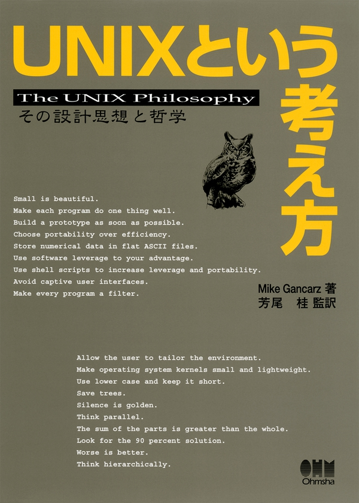

## 名著紹介
これほどまでシンプルに「UNIX/Linuxとは」について書かれた本はない。

「エンジニアとしての信念はUNIXである」とはどういうことなのか。「プログラマとしてのコンセプトはLinuxなのだ」とはどういうことなのか。

そうした、少し偏屈なエンジニアに読んでもらいたい。また、UNIX/Linuxに興味を持っている若者の手にとってもらいたい。

安心してほしい。旅のしおり程度の大きさで厚さは文庫本の半分にも満たない。しかしその中身は、多くのエンジニアを下支えしてきたUNIXという骨について、わかりやすく、かんたんに、そして記憶に残るかずかずの珠玉の言葉を添えしっかりと書かれている。

稚拙ではあるが、ざっくりと要点も付け加えたので興味を持ってもらえたなら、ネット通販などでお買い求めいただきたい。

エンジニアには必須の名著一冊、ここに紹介する。



「UNIXという考え方」
著者 Mike Gancarz 著、芳尾 桂 監訳
定価 1,760円 （本体1,600円＋税）
判型 A5
頁 168頁
ISBN 978-4-274-06406-7
発売日 2001/02/24
発行元 オーム社


## UNIX的なものの考え方とは何か？

UNIXをUNIXらしく使いこなしたい、UNIXらしいプログラムを作りたい人のための一冊です。
OSの背後にある哲学を、9つの定理と平易な言葉で説く
OSを使いこなすためには、その背後にある「哲学」を理解することが必要です。本書では技術的詳細には立ち入らず、その代わりに、今まで文章で表されることが少なかったUNIXの考え方を、9つの「定理」にまとめて平易な言葉で明らかにしています。

定理1：スモール・イズ・ビューティフル
定理2：一つのプログラムには一つのことをうまくやらせる
定理3：できるだけ早く試作を作成する
定理4：効率より移植性
定理5：数値データはASCIIフラットファイルに保存する
定理6：ソフトウェアの挺子を有効に活用する
定理7：シェルスクリプトを使うことで挺子の効果と移植性を高める
定理8：過度の対話的インタフェースを避ける
定理9：すべてのプログラムをフィルタにする

## このような方におすすめ
UNIX系OSのユーザ、プログラマ。UNIXの世界観に興味のある人


## 主要目次
イントロダクション
第1章　UNIXの考え方：たくさんの登場人物たち
第2章　人類にとっての小さな一歩
第3章　楽しみと実益をかねた早めの試作
第4章　移植性の優先順位
第5章　これこそ挺子の効果!
第6章　対話的プログラムの危険性
第7章　さらなる10の小定理
第8章　一つのことをうまくやろう
第9章　UNIXと他のオペレーティングシステムの考え方


## 詳細目次

第1章　UNIXの考え方：たくさんの登場人物たち
1.1 UNIXの考え方：簡単なまとめ

第2章　人類にとっての小さな一歩
2.1 定理1：スモール・イズ・ビューティフル
2.2 やさしいソフトウェア工学
2.3 定理2：一つのプログラムには一つのことをうまくやらせる

第3章　楽しみと実益をかねた早めの試作
3.1 定理3：できるだけ早く試作を作成する
3.2 人間による三つのシステム
3.3 人間による第一のシステム
3.4 人間による第二のシステム
3.5 人間による第三のシステム
3.6 第三のシステムの構築

第4章　移植性の優先順位
4.1 定理4：効率より移植性
4.2 事例研究——Atari 2600
4.3 定理5：数値データはASCIIフラットファイルに保存する
4.4 事例研究——あるUNIXプログラマの道具袋

第5章　これこそ挺子の効果!
5.1 定理6：ソフトウェアの梃子を有効に活用する
5.2 定理7：シェルスクリプトを使うことで梃子の効果と移植性を高める

第6章　対話的プログラムの危険性
6.1 定理8：過度の対話的インタフェースを避ける
6.2 定理9：すべてのプログラムをフィルタにする
6.3 UNIX環境：プログラムをフィルタとして使う

第7章　さらなる10の小定理
7.1 (1) 好みに応じて自分で環境を調整できるようにする
7.2 (2) オペレーティングシステムのカーネルを小さく軽くする
7.3 (3) 小文字を使い、短く
7.4 (4) 木を守る
7.5 (5) 沈黙は金
7.6 (6) 並行して考える
7.7 (7) 部分の総和は全体よりも大きい
7.8 (8) 90パーセントの解を目指す
7.9 (9) 劣るほうが優れている
7.10 (10) 階層的に考える

第8章　一つのことをうまくやろう
8.1 UNIXの考え方：総括

第9章　UNIXと他のオペレーティングシステムの考え方
9.1 Atariホームコンピュータ——芸術としての人間工学
9.2 MS-DOS——7000万人以上のユーザが間違っているはずがない
9.3 OpenVMS——UNIXへのアンチテーゼ？


## ざっくりななめよみ、鈴木めも


### 小さいものは美しい　「スモールイズビューティフル」

小さなプログラムはわかりやすい
小さなプログラムは保守しやすい
小さなプログラムはシステムリソースに易しい
小さなプログラムは他のツールと組み合わせやすい

「伝統的なプログラマは、巨大なアメリカンプログラムによって、
　　世界中の全ての問題を一つのプログラムで解決しようとする。」
「プログラムの９０％はクズである。
　　ただしあらゆるものの９０％はクズである。」

パラメータが一行に収まらない
メソッドが画面に収まらない
コメントを読まないと何をやっているのか思い出せない
lsでモジュール名が多すぎて画面の端から消えていってしまう
まだ開発中なのにエラーメッセージの意味を思い出せない
整理するためにソースコードを印刷している自分に気がついた


### 一つのプログラムには一つの事をうまくやらせる　「わかることは分けること」
「UNIXユーザーは、自分が何をしているのかをわかっている。
　　何をしているのかわからないのなら、ここにいるべきではない」
「一つの事をうまくやるようにプログラムを作れないのであれば、
　　おそらく問題をまだ完全に理解していない。」


a)ユーザーとの対話が必要か。パラメータではだめか
b)入力データは特殊フォーマットが必要か。フォーマット変換プログラムがすでにシステム上にないか。
c)出力データは特殊フォーマットが必要か。通常のASCIIファイルではだめか。
d)新しいプログラムを書かずとも似たような機能を持つ他のプログラムがあるのではないか。

「一つの事をうまくやるようにプログラムを作れないのであれば、
　　おそらく問題をまだ完全に理解していない。」
「しのびよる多機能主義。
　　プログラマはいつだってプログラムを遅くする方法を見つける。」

一つの事をうまくやるようにアプリケーションを書けば、それは必然的に小さなプログラムになる。
小さなプログラムは単一機能になる傾向があり、単一機能のプログラムは小さくなる傾向がある。


### 出来るだけ早く試作する　「反復と協調」
「試作によって学ぶ。早い試作はリスクを減らす。
　「正しく」やっている時間などない」
「「なにができるか」
　　むしろ重要な事は、「なにができないか」を知る事だ。」


三つのシステム
１．第一のシステム
　第一のシステムは正しくやっている時間などない。
　第一のシステムは追い詰められた人間が作る。
　第一のシステムのコンセプトは人々の想像力を刺激する。
　第一のシステムは一人かせいぜい数人からなる小さなグループで作られる。
　第一のシステムは高い情熱によって推進され開発は急速に進む。
　第一のシステムは実に性能がよい。

２．第二のシステム
　第二のシステムは第一のシステムで証明されたアイデアを継承する。
　第二のシステムは委員会が設計する。
　第二のシステムは委員会によりものごとを全て公開の場で自分自身の正当化のために議論を進める。
　第二のシステムは第一のシステムの成功に便乗し分け前にあずかろうとする自称専門家で作られる。
　第二のシステムは自称専門家によりリポジトリ、進捗管理ツールが導入され計画は遅延する。
　第二のシステムは自称専門家のプログラムにおきかえられ贅肉がつき象のようにゆっくり動く。
　第二のシステムは「最初の設計のひどい欠点を見違えるように改善」され多機能となり無知が使う。
　第二のシステムは三つのシステムの中で最悪のシステムである。

３．第三のシステム
　第三のシステムはこれまでのシステムへの反抗から生まれる。
　第三のシステムの名前が変わり、オリジナルのアイデアはもはや常識となる。
　第三のシステムは第一と第二のシステムの最良の特徴を組み合わせる。
　第三のシステムは設計者にとってようやく「正しく」やる事が出来る。
　第三のシステムはユーザーが実際に使用する機能しか含まれない。
　第三のシステムはディスク、メモリ、CPUサイクルなど最適なバランスが実現されている。
　第三のシステムは提供される性能レベルも良くバランスがとれている。

第一のシステムとして「試作」を１ナノ秒でも早く作り、
　第一のシステムと第二のシステムのサイクルを反復と協調し、
　　第三のシステムに向かって協力しながら進んでいく。


### 効率より移植性　bashとawkとsed
「最も効率の良い方法は、
　　ほとんどの場合「移植性」に欠ける。」
「移植か死か。優れたソフトウェアは移植され成長し、
　　それ以外は取り残され捨てられる。」


UNIXにおいてそれはシェルスクリプトしかない。
次のハードウェアはもっと速く走る。だからプログラムを速くするという誘惑に負けない。
わずかな速度を求めてCで書き直さない。それは時間の無駄だ。

シェルスクリプトをあれこれいじる余裕が一瞬でも生じればほとんどのプログラマは
　a) 新しい機能をいくつか付け加えようとする
　b) スクリプトそのものを洗練し、実行速度を高めようとする
　c) その一部、または大部分をCで書き直してパフォーマンスの向上を図ろうとする。

「最も効率の良い方法は、
　　ほとんどの場合「移植性」に欠ける。」
「移植か死か。優れたソフトウェアは移植され成長し、
　　それ以外は取り残され捨てられる。」

DQ1カートリッジ(64kb)用のコード
　自分のプログラマ人生で最も効率の良い、そして移植の難しいコード」を書いた。
　命令をデータとして扱い、データを命令として扱った。
　走査線が画面の右端から左端に引き返すまでの間を狙って命令を実行した。
　メモリ節約のためありとあらゆる技を駆使した。
　こうしてできあがったコードは芸術品と言えるほど見事なものだった。
　フォルクスワーゲンのビートルに２０人ほど詰め込むようなものだった。
　そして保守担当者にとっては究極の悪夢でもあった。


### 出力結果はASCIIフラットファイルに保存する　中間ファイルは作らない　RDBは使わない
「動かせないデータは死んだデータだ。」

出力結果はASCIIフラットファイルに保存する。
安易と稚拙な知識でRDBを使わない。
むやみに中間ファイルをはき出さない。
素晴らしいシステムは中間ファイルI/Oがゼロで、
 全てがメモリ上で稼働する。よってそこそこ高速に動く。


### ソフトウェアを梃子として使う　
「良いプログラマはよいコードを書く。
　　偉大なプログラマは良いコードを借りてくる。」

梃子の支点をいかに自分のほうに近づける事が出来るか
独自技術症候群を避け、すでにあるものにクリエイティブな付加価値をつける
独自技術症候群は創造性を伸ばさない。

「良いプログラマはよいコードを書く。
　　偉大なプログラマは良いコードを借りてくる。」


### シェルスクリプトによって梃子の効果と移植性を高める　パイプ
「私は人生で二度しか奇跡を見た事がない。
　　一つは核融合、もう一つは複利だ
　　　少量のものを繰り返し掛け合わせていく事で、
　　　　やがて奇跡的な規模に達する。」


シェルスクリプトには恐ろしいほどの梃子（てこ）の効果がある
シェルスクリプトは梃子の降下で時間も節約する
シェルスクリプトはCより移植性が高い

「熟練プログラマはシェルスクリプトを熱心に使う。
　　あなたもまたそうするべきだ。」
「UNIXの源流は高水準の抽象化モデル「シェルスクリプト」であり、
　　それは今も普遍である。」
「私は人生で二度しか奇跡を見た事がない。
　　一つは核融合、もう一つは複利だ
　少量のものを繰り返し掛け合わせていく事で、
　　やがて奇跡的な規模に達する。」アインシュタイン

シェルスクリプト一行はおよそ１万倍の複利を生む

```bash 
echo who | awk '{ print $1 ; }' | sort | uniq | sed -e "s/  /,  /g" ;
```

```
echo   177
who    755
awk   3411
sort  2614
uniq   302
sed   2093
---------------------
　　  9.353
```

処理をパイプでつなぎ処理全体を一行で完結させる。
「ひとつのことをうまくやる」の良い事例だ。

```bash
function sh_func_getTitle() {
  TITLE=$(echo ${URLGETOPT} | \
    while read line ;do
      if echo "$line" | grep -i "title=" > /dev/null; then
        echo "$line" | \
          sed -e "s/^.*title=\x27//g" \
              -e "s/\x27.*$//g" \
              -e "s/\r//g" \
              -e "s/<[^>]*>//g" \
              -e "s/^[●○■□△▽]//g"; 
      fi
    done
  );
}
```


### 全てのプログラムをフィルタとして設計する
　メソッド間の入力をstdin、出力はstdoutを使用する
オンメモリでコマンドフィルタとして稼働する。

```bash
function trim(){
  if [ -p /dev/stdin ]; then
    cat - ;
  else
    echo -n ;
  fi | sed -e 's/^ *//g' -e 's/ *$//g'
}
```

実行結果
```
echo "      ほげ      " | trim ;
ほげ
```

以下でも良い。

```bash
function trim(){
  awk '{ print $1; }' | sed -e 's/^ *//g' -e 's/ *$//g'  </dev/stdin
}
```


実行結果
```
echo "      ほげ      " | trim ;
ほげ
```


### 並行して考える
　並列処理が可能なメソッドを積極的に書く


並列処理が可能なメソッドを積極的に書く


 メソッドの並列処理
```bash
#!/bin/bash

##
#
#
function cmd(){ 
  echo "Hello, $1!"; 
}
##
#
#
function sh_xargs(){
  export -f cmd
  yes | head -1000 | xargs -n1 -P4 -I % bash -c "cmd %"
}
##
#
#
sh_xargs ;
```


### 木を守る
　UNIXはドキュメントを忌み嫌う

UNIXユーザーは紙のドキュメントを忌み嫌う。不要なドキュメントを印刷して整理する事はしない。
ソースコードが実体であり、高水準のドキュメントとなるようプログラムする。


## 「ざっくり」シリーズのご紹介
【アルゴリズム ソート比較】ざっくりわかるシェルスクリプト２０
https://suzukiiichiro.github.io/2022-11-02-01-sortcomp-suzuki/
【アルゴリズム クイックソート】ざっくりわかるシェルスクリプト１９
https://suzukiiichiro.github.io/2022-11-01-01-quicksort-suzuki/
【アルゴリズム シェルソート】ざっくりわかるシェルスクリプト１８
https://suzukiiichiro.github.io/2022-10-27-01-shellsort-suzuki/
【アルゴリズム マージソート】ざっくりわかるシェルスクリプト１７
https://suzukiiichiro.github.io/2022-10-19-01-mergesort-suzuki/
【アルゴリズム 連結リスト】ざっくりわかるシェルスクリプト１６
https://suzukiiichiro.github.io/posts/2022-10-18-01-list-suzuki/
【アルゴリズム 再帰】ざっくりわかるシェルスクリプト１５
https://suzukiiichiro.github.io/posts/2022-10-07-01-algorithm-recursion-suzuki/
【アルゴリズム キュー】ざっくりわかるシェルスクリプト１４
https://suzukiiichiro.github.io/posts/2022-10-06-01-algorithm-queue-suzuki/
【アルゴリズム スタック】ざっくりわかるシェルスクリプト１３
https://suzukiiichiro.github.io/posts/2022-10-06-01-algorithm-stack-suzuki/
【アルゴリズム 挿入ソート】ざっくりわかるシェルスクリプト１２
https://suzukiiichiro.github.io/posts/2022-10-05-01-algorithm-insertionsort-suzuki/
【アルゴリズム 選択ソート】ざっくりわかるシェルスクリプト１１
https://suzukiiichiro.github.io/posts/2022-10-05-01-algorithm-selectionsort-suzuki/
【アルゴリズム バブルソート】ざっくりわかるシェルスクリプト１０
https://suzukiiichiro.github.io/posts/2022-10-05-01-algorithm-bubblesort-suzuki/
【アルゴリズム ビッグオー】ざっくりわかるシェルスクリプト９
https://suzukiiichiro.github.io/posts/2022-10-04-01-algorithm-bigo-suzuki/
【アルゴリズム ２次元配列編】ざっくりわかるシェルスクリプト８
https://suzukiiichiro.github.io/posts/2022-10-03-01-algorithm-eval-array-suzuki/
【アルゴリズム 配列準備編】ざっくりわかるシェルスクリプト７
https://suzukiiichiro.github.io/posts/2022-10-03-01-algorithm-array-suzuki/ 
【アルゴリズム 配列編】ざっくりわかるシェルスクリプト６
https://suzukiiichiro.github.io/posts/2022-09-27-01-array-suzuki/
【grep/sed/awkも】ざっくりわかるシェルスクリプト５
https://suzukiiichiro.github.io/posts/2022-02-02-01-suzuki/
【grep特集】ざっくりわかるシェルスクリプト４
https://suzukiiichiro.github.io/posts/2022-01-24-01-suzuki/
【はじめから】ざっくりわかるシェルスクリプト３
https://suzukiiichiro.github.io/posts/2022-01-13-01-suzuki/
【はじめから】ざっくりわかるシェルスクリプト２
https://suzukiiichiro.github.io/posts/2022-01-12-01-suzuki/
【はじめから】ざっくりわかるシェルスクリプト１
https://suzukiiichiro.github.io/posts/2022-01-07-01-suzuki/

【TIPS】ざっくりわかるシェルスクリプト
https://suzukiiichiro.github.io/posts/2022-09-26-01-tips-suzuki/


<!--
{}
ヒント
{}

{}
注意
{}
-->


## 書籍の紹介
{{% amazon

title="UNIXという考え方―その設計思想と哲学 単行本 – 2001/2/23"
url="https://www.amazon.co.jp/UNIX%25E3%2581%25A8%25E3%2581%2584%25E3%2581%2586%25E8%2580%2583%25E3%2581%2588%25E6%2596%25B9%25E2%2580%2595%25E3%2581%259D%25E3%2581%25AE%25E8%25A8%25AD%25E8%25A8%2588%25E6%2580%259D%25E6%2583%25B3%25E3%2581%25A8%25E5%2593%25B2%25E5%25AD%25A6-Mike-Gancarz/dp/4274064069/ref=sr_1_1?keywords=unix%25E3%2581%25A8%25E3%2581%2584%25E3%2581%2586%25E8%2580%2583%25E3%2581%2588%25E6%2596%25B9&amp;qid=1667786898&amp;qu=eyJxc2MiOiIxLjEwIiwicXNhIjoiMC4zOSIsInFzcCI6IjAuMzEifQ%253D%253D&amp;sprefix=unix%25E3%2581%25A8%25E3%2581%2584%25E3%2581%2586%252Caps%252C257&amp;sr=8-1&_encoding=UTF8&tag=nlpqueens09-22&linkCode=ur2&linkId=0249eb4cab50d700fb6949eb9aeafef1&camp=247&creative=1211"
imageUrl="https://m.media-amazon.com/images/I/518ME653H3L._SX330_BO1,204,203,200_.jpg"
summary=`   UNIX系のOSは世界で広く使われている。UNIX、Linux、FreeBSD、Solarisなど、商用、非商用を問わず最も普及したOSのひとつであろう。そしてこのOSは30年にわたって使用され続けているものでもある。なぜこれほど長い間使われてきたのか？ その秘密はUNIXに込められた数々の哲学や思想が握っている。
   そもそもUNIXはMulticsという巨大なOSの開発から生まれたものだ。あまりに巨大なMulticsはその複雑さゆえに開発は遅々として進まず、その反省からケン・トンプソンが作ったのがUNIXの初めとされる。その後デニス・リッチーら多数の開発者が携わり、UNIXは発展した。本書はこのUNIXに込められた「思想と哲学」を抽出し、数々のエピソードとともにUNIXの特徴を浮き彫りにしていく。

   たとえば本書で述べられているUNIXの発想のひとつとして「過度の対話式インタフェースを避ける」というものがある。UNIXのシステムは初心者には「不親切」なつくり、つまり親切な対話式のインタフェースはほとんどなく、ユーザーがコマンドを実行しようとするときはオプションをつける形をとっている。この形式はオプションをいちいち覚えねばならず、初心者に決してやさしくない。しかしこれはプログラムを小さく単純なものにし、他のプログラムとの結合性を高くする。そして結果としてUNIXのスケーラビリティと移植性の高さを支えることになっているのだ。このような形式で本書では9つの定理と10の小定理を掲げ、UNIXが何を重視し、何を犠牲にしてきたのかを明快に解説している。

   最終章にはMS-DOSなどほかのOSの思想も紹介されている。UNIXの思想が他のOSとどう違うかをはっきり知ることになるだろう。UNIXの本質を理解するうえで、UNIX信者もUNIX初心者にとっても有用な1冊だ。（斎藤牧人）`
%}}

{{% amazon

title="詳解 シェルスクリプト 大型本  2006/1/16"

url="https://www.amazon.co.jp/gp/proteect/4873112672/ref=as_li_tl?ie=UTF8&camp=247&creative=1211&creativeASIN=4873112672&linkCode=as2&tag=nlpqueens09-22&linkId=ef087fd92d3628bb94e1eb10cb202d43"

summary=`Unixのプログラムは「ツール」と呼ばれます。
Unixは、処理を実現するために複数の道具(ツール)を組み合わせる「ソフトウェアツール」という思想の下に設計されているためです。
そしてこれらツールを「組み合わせる」ということこそがUnixの真髄です。
また、シェルスクリプトの作成には言語自体だけでなくそれぞれのツールに対する理解も求められます。
つまり、あるツールが何のためのものであり、それを単体あるいは他のプログラムと組み合わせて利用するにはどのようにすればよいかということを理解しなければなりません。
本書は、Unixシステムへの理解を深めながら、シェルスクリプトの基礎から応用までを幅広く解説します。
標準化されたシェルを通じてUnix(LinuxやFreeBSD、Mac OS XなどあらゆるUnix互換OSを含む)の各種ツールを組み合わせ、
目的の処理を実現するための方法を詳しく学ぶことができます。
`
imageUrl="https://m.media-amazon.com/images/I/51EAPCH56ML._SL250_.jpg"
%}}

{}


{{% amazon

title="[改訂第3版]シェルスクリプト基本リファレンス ──#!/bin/shで、ここまでできる (WEB+DB PRESS plus) 単行本（ソフトカバー）  2017/1/20"

url="https://www.amazon.co.jp/gp/proteect/4774186945/ref=as_li_tl?ie=UTF8&camp=247&creative=1211&creativeASIN=4774186945&linkCode=as2&tag=nlpqueens09-22&linkId=8ef3ff961c569212e910cf3d6e37dcb6"

summary=`定番の1冊『シェルスクリプト基本リファレンス』の改訂第3版。
シェルスクリプトの知識は、プログラマにとって長く役立つ知識です。
本書では、複数のプラットフォームに対応できる移植性の高いシェルスクリプト作成に主眼を置き、
基本から丁寧に解説。
第3版では最新のLinux/FreeBSD/Solarisに加え、組み込み分野等で注目度の高いBusyBoxもサポート。
合わせて、全収録スクリプトに関してWindowsおよびmacOS環境でのbashの動作確認も行い、さらなる移植性の高さを追求。
ますますパワーアップした改訂版をお届けします。`
imageUrl="https://m.media-amazon.com/images/I/41i956UyusL._SL250_.jpg"
%}}

{{% amazon

title="新しいシェルプログラミングの教科書 単行本"

url="https://www.amazon.co.jp/gp/proteect/4797393106/ref=as_li_tl?ie=UTF8&camp=247&creative=1211&creativeASIN=4797393106&linkCode=as2&tag=nlpqueens09-22&linkId=f514a6378c1c10e59ab16275745c2439"

summary=`エキスパートを目指せ!!

システム管理やソフトウェア開発など、
実際の業務では欠かせないシェルスクリプトの知識を徹底解説

ほとんどのディストリビューションでデフォルトとなっているbashに特化することで、
類書と差別化を図るとともに、より実践的なプログラミングを紹介します。
またプログラミング手法の理解に欠かせないLinuxの仕組みについてもできるかぎり解説しました。
イマドキのエンジニア必携の一冊。

▼目次
CHAPTER01 シェルってなんだろう
CHAPTER02 シェルスクリプトとは何か
CHAPTER03 シェルスクリプトの基本
CHAPTER04 変数
CHAPTER05 クォーティング
CHAPTER06 制御構造
CHAPTER07 リダイレクトとパイプ
CHAPTER08 関数
CHAPTER09 組み込みコマンド
CHAPTER10 正規表現と文字列
CHAPTER11 シェルスクリプトの実行方法
CHAPTER12 シェルスクリプトのサンプルで学ぼう
CHAPTER13 シェルスクリプトの実用例
CHAPTER14 テストとデバッグ
CHAPTER15 読みやすいシェルスクリプト
`
imageUrl="https://m.media-amazon.com/images/I/41d1D6rgDiL._SL250_.jpg"
%}}


