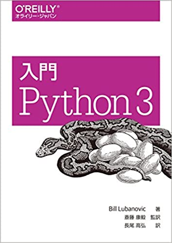

## リストの数を要素を数えたいのですが、
### 方法１．set()で数える

```python
names = ['Joseph', 'Anna', 'Lily', 'Henry', 'Joseph']
print(len(set(names)))
# 4
```

### 方法２．collectionsモジュールのCounter()/keys()を使う
```python
from collections import Counter
list_value = ['Joseph', 'Anna', 'Lily', 'Henry', 'Joseph']
counter_object = Counter(list_value)
  keys = counter_object.keys()
  print(len(keys))
  # 4
```

### 方法３．forループでかたくなに数える
```python
names = ['Joseph', 'Anna', 'Lily', 'Henry', 'Joseph']
no_duplicates = list()
count = 0
for name in names:
    if name not in no_duplicates:
        no_duplicates.append(name)
        count += 1
print(count)
# 4
```

### 方法４．numpyを使う
```python
import numpy
names = ['Joseph', 'Anna', 'Lily', 'Henry', 'Joseph']
array = numpy.array(names)
unique = numpy.unique(array)
print(len(unique))
# 4
```

Python リスト内の固有の値をカウントするには、Python では「 set()」関数、「collections」モジュール、「for」ループ、または「numpy 」ライブラリが使用されます。set オブジェクトは、「 set() 」メソッドで作成でき、リスト内の個別の値を数えるために使用できる、順序付けされていない一意の要素のコレクションです。同様に、「collections」モジュールの「Counter()」関数、「for」ループ、または「numpy」ライブラリを使用して、リスト内の固有の値をカウントすることもできます。

